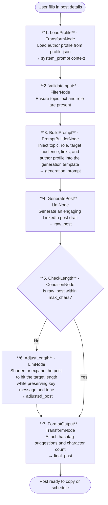

# 000 - LinkedIn Post Generator

## Project Overview

This example builds a context-aware LinkedIn post generator using ASP.NET Core Blazor Server and the **TwfAiFramework**. The application accepts a message topic, the author's current role, and a target audience, then produces an engaging, on-brand LinkedIn post calibrated to the right length and tone. Technical posts can include related links automatically woven into the content.

A persistent author profile (`profile.json`) stores the system-level context — personal bio, writing style guidelines, and previous post references — so that information is applied to every generation without the user re-entering it. The profile can be viewed and updated from the UI at any time.

## Objective

Demonstrate a practical, profile-driven content generation workflow for professionals who publish regularly on LinkedIn:

- Use a persistent `profile.json` to carry author identity, guidelines, and previous post references into every generation as a system prompt
- Use `LlmNode` with a role- and audience-aware prompt to produce posts that match the author's voice
- Use `TransformNode` to enforce a configurable character-length target, shortening or expanding the draft as needed
- Optionally inject related technical links into the post for developer or architect audiences
- Expose profile management in the UI so authors can update their bio, guidelines, or past-post references without touching a config file directly

## End-to-End Workflow



## Why This Pattern Works

A single-prompt approach produces generic posts that ignore the author's voice, their audience's context, and platform norms. Separating profile loading, prompt construction, generation, and length enforcement into distinct stages keeps each step focused and tunable.

That separation improves:

- **Voice consistency** because the system prompt is built from the same persistent profile every time — the model always knows who is writing and for whom
- **Length accuracy** because a dedicated `LlmNode` pass targets the character limit after the draft exists, rather than asking one prompt to generate and constrain simultaneously
- **Relevance** because role and audience are injected as explicit variables, not buried in a general instruction
- **Maintainability** because updating the author bio, guidelines, or past-post references in the profile UI propagates to every future generation automatically

## Key Features

| Feature | Detail |
|---|---|
| **Persistent author profile** | `profile.json` stores bio, writing guidelines, and previous post references; loaded as system prompt for every generation |
| **Profile management UI** | Authors can view and edit their profile from within the app — no manual file editing required |
| **Role-aware generation** | Post tone and vocabulary adapt to the author's current role (developer, architect, manager, etc.) |
| **Target audience framing** | Content is shaped for the specified audience (engineers, executives, job seekers, etc.) |
| **Configurable max length** | `max_chars` controls whether the post is shortened or expanded in a dedicated adjustment pass |
| **Technical link injection** | Related URLs are automatically embedded in posts tagged as technical content |
| **Hashtag suggestions** | `TransformNode` appends relevant hashtag recommendations based on topic and role |

## Inputs

### Per-Post Inputs (provided in the UI each time)

| Input | Purpose | Example |
|---|---|---|
| `topic` | The core message or subject of the post | "Why I switched from REST to gRPC for internal services" |
| `current_role` | The author's current professional role | `developer`, `architect`, `engineering-manager`, `cto` |
| `target_audience` | Who the post is written for | `engineers`, `hiring-managers`, `product-managers`, `general` |
| `max_chars` | Maximum character length for the final post | `1300` (LinkedIn soft limit is ~3000; shorter posts get higher reach) |
| `related_links` | Optional URLs to weave into a technical post | `["https://grpc.io/docs/", "https://protobuf.dev/"]` |
| `additional_context` | Any extra context for this specific post | "Mention our migration took 3 weeks and reduced latency by 40%" |

### Profile Inputs (stored in `profile.json`, editable from UI)

| Field | Purpose | Example |
|---|---|---|
| `my_profile` | Author bio — who you are, your background, your expertise | "Senior engineer at a fintech startup, 10 years in distributed systems" |
| `writing_guidelines` | Style rules for every post | "Write in first person. No corporate buzzwords. Use short paragraphs." |
| `previous_post_references` | Links or text excerpts of past posts the model should mirror | Past post titles or URLs used as tone anchors |
| `default_role` | Pre-filled role shown in the UI | `architect` |
| `default_audience` | Pre-filled audience shown in the UI | `engineers` |
| `default_max_chars` | Pre-filled character limit shown in the UI | `1300` |

## Expected Output

```json
{
  "post": "I spent three weeks ripping REST out of our internal services and replacing it with gRPC.\n\nThe result? A 40% drop in p99 latency and a team that stopped arguing about HTTP status codes.\n\nHere's what pushed us over the line...\n\n[full post text continues]",
  "char_count": 1287,
  "hashtag_suggestions": ["#grpc", "#distributed-systems", "#backend", "#engineeringlife"],
  "generated_at": "2026-04-19T08:15:00Z"
}
```

## Suggested Project Structure

```text
000_LinkedInPostGenerator/
├── Components/
│   ├── Pages/
│   │   ├── Generator.razor            # Post input form and generated post display
│   │   └── Profile.razor              # Author profile viewer and editor
│   ├── Layout/
│   │   ├── MainLayout.razor
│   │   └── NavMenu.razor
│   └── App.razor
├── Controllers/
│   └── PostController.cs              # POST /api/post/generate
├── Models/
│   ├── PostRequest.cs                 # topic, current_role, target_audience, max_chars, related_links
│   ├── AuthorProfile.cs              # my_profile, writing_guidelines, previous_post_references, defaults
│   └── GeneratedPost.cs              # post, char_count, hashtag_suggestions, generated_at
├── Services/
│   ├── PostWorkflowService.cs         # Builds and runs the TwfAiFramework workflow
│   └── ProfileService.cs             # Reads and writes profile.json
├── Constants.cs                       # Prompt templates and system prompt builder
├── Program.cs                         # Dependency injection and app bootstrap
├── profile.json                       # Persistent author profile (committed with safe defaults)
├── appsettings.json                   # Model defaults
└── appsettings.local.json             # Local API key overrides (gitignored)
```

## Setup

### 1. Configure the LLM Provider

Create `appsettings.local.json` in the project root:

```json
{
  "OpenAI": {
    "ApiKey": "sk-your-api-key",
    "Model": "gpt-4o-mini",
    "Endpoint": "https://api.openai.com/v1/chat/completions"
  }
}
```

### 2. Configure the Author Profile

Edit `profile.json` directly or use the Profile page in the running app:

```json
{
  "my_profile": "Your bio here — who you are, your background, what you care about.",
  "writing_guidelines": "Write in first person. Be specific. Avoid jargon. Use short paragraphs. No emojis unless the topic calls for it.",
  "previous_post_references": [
    "Post title or excerpt 1 — used to anchor tone",
    "Post title or excerpt 2"
  ],
  "default_role": "architect",
  "default_audience": "engineers",
  "default_max_chars": 1300
}
```

### 3. Run the Application

```bash
dotnet run
```

The application will start at `https://localhost:5001`.

### 4. Typical Request Flow

1. Author opens the Generator page — role, audience, and max length are pre-filled from their profile.
2. Author types a topic, optionally pastes related links and extra context, then clicks Generate.
3. The workflow loads the author profile and builds a system prompt from it.
4. The generation stage produces a draft LinkedIn post.
5. The length check stage shortens or expands the draft to hit `max_chars`.
6. The formatted post with hashtag suggestions is displayed and ready to copy.

## TwfAiFramework Implementation Sketch

```csharp
var authorProfile = await profileService.LoadAsync();

var result = await Workflow.Create("LinkedInPostGenerator")
    .UseLogger(logger)
    .AddNode(new FilterNode(data =>
        !string.IsNullOrWhiteSpace(data.Get<string>("topic")) &&
        !string.IsNullOrWhiteSpace(data.Get<string>("current_role"))))
    .AddNode(new PromptBuilderNode(
        promptTemplate: Constants.PostGenerationPrompt,
        systemTemplate: Constants.BuildSystemPrompt(authorProfile)))
    .AddNode(new LlmNode(new LlmConfig
    {
        Provider = "openai",
        Model = "gpt-4o-mini",
        ApiKey = config["OpenAI:ApiKey"]!
    }))
    .AddNode(new ConditionNode(
        condition: data => data.Get<string>("raw_post").Length <= data.Get<int>("max_chars"),
        truePath: "FormatOutput",
        falsePath: "AdjustLength"))
    .AddNode(new LlmNode(new LlmConfig   // AdjustLength branch
    {
        Provider = "openai",
        Model = "gpt-4o-mini",
        ApiKey = config["OpenAI:ApiKey"]!,
        SystemPrompt = Constants.LengthAdjustmentPrompt
    }), name: "AdjustLength")
    .AddNode(new TransformNode(data =>
    {
        data.Set("char_count", data.Get<string>("post").Length);
        data.Set("hashtag_suggestions", HashtagExtractor.Suggest(data));
        return data;
    }), name: "FormatOutput")
    .RunAsync(new WorkflowData()
        .Set("topic", request.Topic)
        .Set("current_role", request.CurrentRole)
        .Set("target_audience", request.TargetAudience)
        .Set("max_chars", request.MaxChars)
        .Set("related_links", request.RelatedLinks)
        .Set("additional_context", request.AdditionalContext));
```

## Prompt Strategy

### System Prompt (built from `profile.json`)

The system prompt is constructed once per request from the stored profile and wraps all generation stages:

```
You are a LinkedIn post writer for {my_profile}.

Writing guidelines:
{writing_guidelines}

Previous posts to use as tone and style references:
{previous_post_references}

Always write posts that feel personal and specific, not generic or corporate.
```

### Post Generation Prompt

The generation prompt injects per-request variables:

- the topic and any additional context
- the author's current role (used to calibrate depth and vocabulary)
- the target audience (used to calibrate what to explain and what to assume)
- any related technical links to embed naturally in the post
- the target character limit as a soft guide for the initial draft

### Length Adjustment Prompt

When the draft exceeds `max_chars`, a second `LlmNode` pass receives:

- the original draft
- the target character count
- an instruction to shorten or expand while preserving the core message, opening hook, and call to action

## Profile Management

The `Profile.razor` page exposes a form backed by `ProfileService`, which reads and writes `profile.json`. Changes are applied immediately to the next generation — no restart required.

The profile page includes:

- a text area for the author bio
- a text area for writing guidelines
- a list editor for previous post references (add / remove entries)
- pre-filled defaults for role, audience, and max length
- a Save button that persists changes to `profile.json`

Because `profile.json` is committed to the repository with safe placeholder values, new team members can clone and run the app immediately and fill in their own profile through the UI.

## Operational Considerations

### Reliability

- Add `NodeOptions.WithRetry(2)` around both `LlmNode` calls to handle transient API timeouts
- Log the system prompt and generation prompt at `Debug` level so prompt changes can be audited
- Validate `max_chars` is between 100 and 3000 to prevent degenerate adjustment loops

### Quality Control

- Display the character count live in the UI so the author can adjust `max_chars` before generating
- Provide a one-click regenerate button that reruns the workflow with the same inputs but a different random seed
- Offer a diff view when the length adjustment pass modifies the draft so the author can see what changed

### Profile Safety

- `profile.json` should be committed with placeholder values — never commit real personal details to a public repository
- `appsettings.local.json` holds API keys and is gitignored; `profile.json` holds content and is tracked

## Good Fit Scenarios

This workflow is a good fit for:

- developers, architects, and engineering managers who publish technical thought leadership regularly
- professionals building a personal brand who want consistent voice across posts
- teams where multiple people contribute posts under a shared brand identity (each person has their own profile)
- content calendars where posts are drafted in batches and reviewed before publishing

It is a weaker fit for highly visual content that requires image generation, or for real-time reactive posts where the delay from a multi-stage pipeline would be impractical.

## Possible Extensions

- Add a scheduling integration (Buffer, LinkedIn API) so approved posts can be queued directly from the app
- Add a tone slider (formal ↔ casual) as a per-post input that overrides the guideline default
- Store generated posts in a local history so the author can reference them in future profile updates without copying text manually
- Add a `Workflow.Parallel()` path that generates two length variants simultaneously so the author can pick the better one
- Integrate a readability scorer (`TransformNode` calling a scoring API) to flag posts that score below a threshold before they reach the author

## Summary

Example 0 is a profile-driven post generation pipeline rather than a stateless prompt wrapper. The core pattern is straightforward and reusable:

1. load the author profile and build a persistent system prompt with `TransformNode`
2. construct the per-request generation prompt with `PromptBuilderNode`
3. generate the draft post with `LlmNode`
4. enforce the character target with a conditional `LlmNode` adjustment pass
5. attach metadata and hashtag suggestions with a final `TransformNode`

That sequence maps cleanly to how professional writers actually work: start with voice and context, draft for message, then edit for length and platform constraints.
