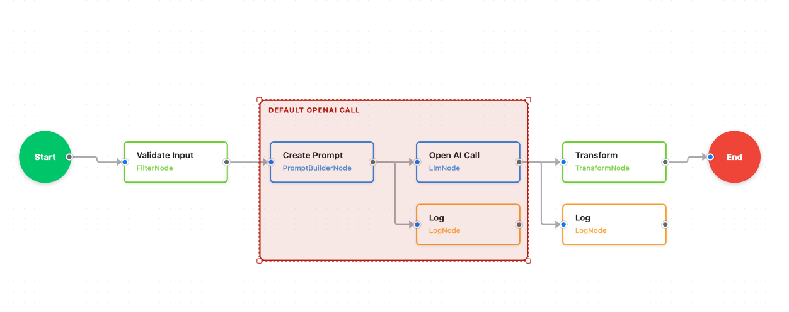
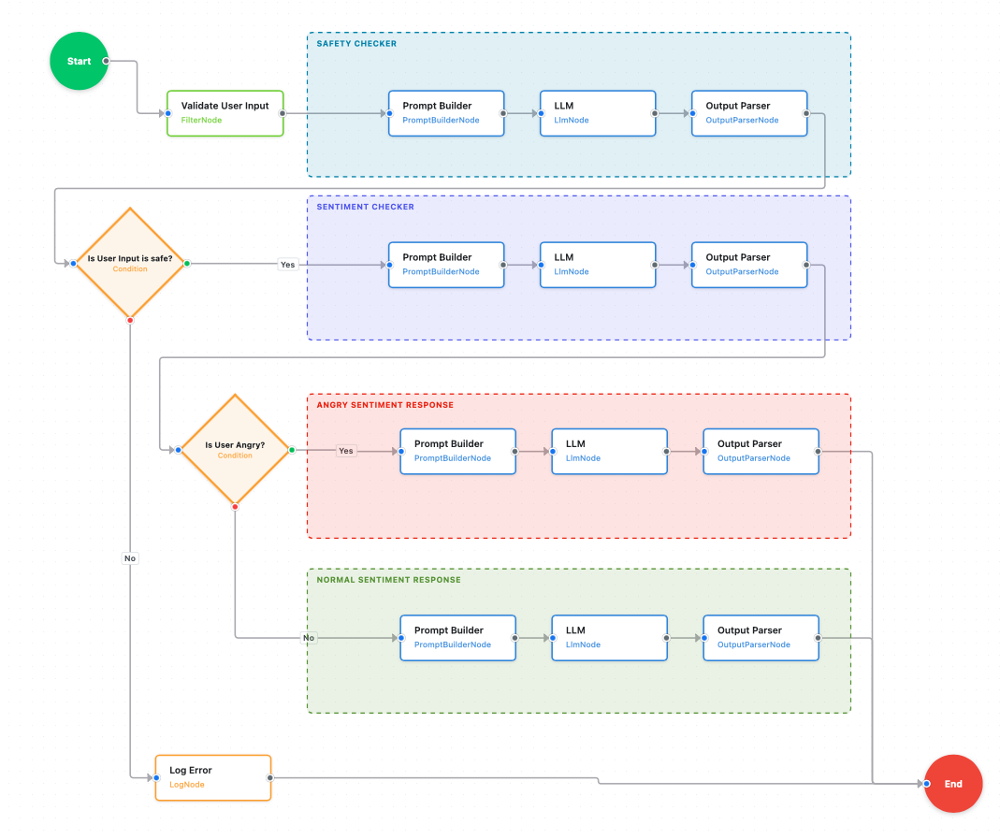

# 001 - Customer Support Chatbot

## Project Overview

This example builds a multi-turn customer support chatbot for a fictional company, **TechWayFit Inc.**, using ASP.NET Core Blazor Server and the **Twf AI Framework**. The chatbot exposes a REST API consumed by an interactive chat UI and processes each message through a composable, node-based AI workflow.

Three progressively richer workflow modes can be selected at runtime:

| Bot Mode | Description |
|---|---|
| `basic` | Single LLM call — prompt → response |
| `safetycheck` | Safety classification before responding; rejects harmful messages |
| `sentiment` *(default)* | Safety check → sentiment analysis → empathetic escalation or standard response |

## Objective

The goal is to demonstrate real-world patterns that every production AI chat system needs:

- **Composable workflow pipelines** — chain `FilterNode`, `PromptBuilderNode`, `LlmNode`, `OutputParserNode`, and custom `AddStep` lambdas in a readable, testable graph
- **Input validation** — enforce non-empty messages and a 500-character length limit before any LLM call
- **Content safety** — use a fast, token-limited LLM call to classify messages as safe/unsafe before spending tokens on a full response
- **Sentiment-driven routing** — score customer sentiment (1–10); automatically escalate to an empathetic senior-support persona when anger score ≥ 7
- **Multi-turn conversation memory** — `MaintainHistory = true` on `LlmNode` keeps the full dialogue in context across turns
- **Configuration layering / secret management** — `appsettings.local.json` overrides keep API keys out of source control
- **Retry resilience** — `NodeOptions.WithRetry(2)` wraps every LLM node for transient failure recovery

## Key Features

- **AI-Powered Responses** — Uses OpenAI-compatible GPT models (configurable model and endpoint)
- **Real-time Chat** — Interactive Blazor Server chat interface with no page reloads
- **Sentiment Analysis** — Detects angry customers (score ≥ 7 on a 1–10 scale) and routes to an empathetic persona
- **Safety Guardrails** — A dedicated LLM classifier rejects harmful, abusive, or phishing-style messages before the main LLM ever sees them
- **Session Management** — Per-session `WorkflowContext` maintains conversation history across turns
- **Bootstrap UI** — Responsive chat widget via Bootstrap 5.3.3 CDN; color-coded badges and sentiment icons
- **Rich Formatting** — Markdown-like bold, bullet, and numbered-list rendering in chat bubbles

## Project Structure

```
001_CustomerSupportChatbot/
├── Components/
│   ├── Pages/
│   │   ├── Home.razor          # Chat UI — message bubbles, badges, sentiment icons
│   │   └── Error.razor
│   ├── Layout/
│   │   ├── MainLayout.razor
│   │   └── NavMenu.razor
│   └── App.razor               # Bootstrap CDN configuration
├── Controllers/
│   └── ChatApiController.cs    # POST /api/ChatApi/message — orchestrates workflows
├── wwwroot/                    # Static assets (app.css)
├── Constants.cs                # All prompt templates and message strings
├── Program.cs                  # App / DI configuration
├── appsettings.json            # Base configuration (committed)
├── appsettings.Development.json
└── appsettings.local.json      # API key overrides (gitignored)
```

## Setup

### 1. Configure API Key

**Option A: Using appsettings.local.json (Recommended)**

Create `appsettings.local.json` in the project root and add your OpenAI API key:

```json
{
  "OpenAI": {
    "ApiKey": "sk-your-actual-openai-api-key-here"
  }
}
```

This file is automatically excluded from source control via `.gitignore`.

**Option B: Using appsettings.json**

Edit `appsettings.json` and add your OpenAI API key:

```json
{
  "OpenAI": {
    "ApiKey": "sk-your-actual-openai-api-key-here"
  }
}
```

**Security Note:**
- For local development, use `appsettings.local.json` to keep your API key out of source control
- For production, use environment variables or Azure Key Vault instead of hardcoding API keys
- Never commit API keys to version control

### 2. Run the Application

```bash
dotnet run
```

The application will start at `https://localhost:5001` (or the port shown in the console).

### 3. Use the Chat

1. Navigate to the home page
2. Type your message in the input field
3. Press Enter or click Send
4. The bot will respond based on sentiment and safety analysis

## UI Features

### Rich Text Formatting

The chat interface supports rich HTML formatting:

- **Bold text** - Use `**text**` in LLM responses
- *Italic text* - Use `*text*` in LLM responses
- Bullet lists - Auto-formatted with `-` prefix
- Numbered lists - Auto-formatted with `1.`, `2.`, etc.
- Paragraphs - Double line breaks create new paragraphs

### Visual Indicators

- **Color-coded response badges:**
  - Standard - Green badge
  - Escalation - Yellow badge
  - Rejected - Red badge
- **Sentiment icons:** Positive, Neutral, Negative, Angry
- **Timestamps** - Each message shows send time
- **Message bubbles** - Different styles for user vs bot

### Dependencies

The application uses Bootstrap 5.3.3 and Bootstrap Icons via CDN:
- **Bootstrap CSS/JS**: https://cdn.jsdelivr.net/npm/bootstrap@5.3.3/
- **Bootstrap Icons**: https://cdn.jsdelivr.net/npm/bootstrap-icons@1.11.3/

No local Bootstrap files are needed - everything loads from CDN for faster updates and smaller repository size.

## How It Works

### Simple Flow (`basic` mode)

The simplest path — input validation followed by a single prompt-and-LLM call. No safety or sentiment branching.



| Node | Type | Purpose |
|---|---|---|
| Validate Input | `FilterNode` | Reject empty or oversized messages |
| Create Prompt | `PromptBuilderNode` | Inject company name and user message into template |
| Open AI Call | `LlmNode` | Generate the support response |

---

### Full Flow (`sentiment` mode — default)

The production-ready pipeline. Two classification checks gate the main response, and a conditional branch routes angry customers to an empathetic escalation path.



| Stage | Nodes | Purpose |
|---|---|---|
| **Safety Checker** | `PromptBuilderNode` → `LlmNode` → `OutputParserNode` | Classify message as safe/unsafe |
| **Condition** | `Is User Input is safe?` | Branch on safety result |
| **Sentiment Checker** | `PromptBuilderNode` → `LlmNode` → `OutputParserNode` | Score sentiment (positive / neutral / negative / angry, 1–10) |
| **Condition** | `Is User Angry?` | Branch when sentiment == "angry" or score ≥ 7 |
| **Angry Sentiment Response** | `PromptBuilderNode` → `LlmNode` → `OutputParserNode` | Empathetic escalation response with `MaintainHistory = true` |
| **Normal Sentiment Response** | `PromptBuilderNode` → `LlmNode` → `OutputParserNode` | Standard helpful response with `MaintainHistory = true` |
| **Log Error** | `LogNode` | Captures any upstream failure before returning to End |


### API Endpoints

**POST** `/api/ChatApi/message`

Request body:
```json
{
  "sessionId": "optional-existing-session-id",
  "message": "I need help with my order",
  "botType": "basic | safetycheck | sentiment"
}
```

Response:
```json
{
  "sessionId": "unique-session-id",
  "message": "I'd be happy to help you with your order...",
  "responseType": "standard | escalation | rejected",
  "sentiment": "positive | neutral | negative | angry",
  "timestamp": "2025-01-15T10:30:00Z"
}
```

**DELETE** `/api/ChatApi/session/{sessionId}` — clears in-memory conversation history for a session

## Customization

### Adjust Response Tone

Edit `ChatApiController.cs` and modify the prompt templates:

```csharp
// For standard responses
promptTemplate: @"
    Help this customer professionally.
 Company: {{company_name}}
    Message: {{user_message}}
    
    Use formatting:
    - Use **bold** for key information
    - Use bullet points (-) for lists
    - Use numbered lists (1., 2., 3.) for steps
"

// For angry customers
promptTemplate: @"
    Customer is angry. Be empathetic and offer concrete help.
  Company: {{company_name}}
    Message: {{user_message}}
    
    Use formatting to make your response clear and caring.
"
```

### Change Sentiment Threshold

Modify the anger detection threshold in `BuildCustomerSupportWorkflow`:

```csharp
.Branch(data => data.GetString("sentiment") == "angry" || 
 data.Get<int>("anger_score") >= 7,  // Change this value (1-10)
```

### Customize UI Styling

The chat interface uses Bootstrap 5.3 classes. You can customize:

1. **Colors** - Modify Bootstrap theme colors in `app.css`
2. **Message styling** - Edit `<style>` section in `Home.razor`
3. **Icons** - Change Bootstrap Icons in the component
4. **Layout** - Adjust container sizes and spacing

### Add More Workflow Nodes

The framework supports:
- **HTTP requests** - Integrate with CRM/ticketing systems
- **Data transforms** - Format/validate data
- **Parallel execution** - Run multiple checks simultaneously
- **Loops** - Process multiple items
- **Conditional branching** - Complex decision trees

See `source/core/README.md` for full documentation.

## Configuration Files

- **appsettings.json** - Base configuration (committed to source control)
- **appsettings.Development.json** - Development-specific settings
- **appsettings.local.json** - Local overrides for sensitive data (gitignored)

The configuration is loaded in order, with later files overriding earlier ones. This means `appsettings.local.json` takes precedence over all other settings files.

## Learning Objectives

This example demonstrates:

1. **Prompt Engineering** - Control LLM tone and persona through system/user prompts
2. **Conversation Memory** - Using `MaintainHistory = true` for multi-turn chat
3. **Intent Classification** - Detecting sentiment and routing accordingly
4. **Confidence Thresholds** - Scoring responses (1-10) for escalation decisions
5. **HITL Design** - Architecture ready for human agent handoff
6. **CRM Integration Points** - Structure for connecting to external systems
7. **Rich UI Formatting** - HTML rendering with markdown-like syntax
8. **Modern Web Development** - CDN-based dependencies, responsive design

## Next Steps

### Extend the Workflow — Real-World Challenges

Try extending this example to handle real-world scenarios. Each one maps to a new node or branch in the workflow pipeline:

- [ ] **Add a topic relevance check** *(recommended first extension)*
  
  Right now the bot answers any question — ask *"Who is the current US president?"* and the LLM will happily respond. In a real support bot that's a problem. Add a `TopicClassifier` node immediately after the safety check. Prompt a small LLM call to decide whether the message is relevant to **TechWayFit Inc.** support topics. If not, return a polite redirect:
  *"I can only help with TechWayFit account and product questions. For anything else, please use a general search engine."*
  
  This mirrors the same pattern as the safety check — a fast classification call that gates the main response.

- [ ] **Add FAQ matching before the LLM call** — check common questions against a static list first; only fall back to LLM if no match is found (reduces cost and latency)
- [ ] **Integrate with a real CRM API** (Salesforce, HubSpot, etc.) — look up the customer's account and inject real order/ticket data into the prompt context
- [ ] **Add a confidence score gate** — if the LLM's sentiment score is 5–6 (borderline), route to a "soft escalation" path instead of standard/full escalation
- [ ] **Track order numbers** — extract order IDs from the message using a regex or LLM extraction node, then pull live order status from a backend API
- [ ] **Implement human agent handoff** — when `response_type == "escalation"`, push the conversation to a live agent queue (e.g., Zendesk, Teams)
- [ ] **Add database for persistent conversation history** — replace the in-memory `_sessions` dictionary with a database so history survives restarts
- [ ] **Add authentication and user profiles** — tie sessions to authenticated users so the bot can personalise responses
- [ ] **Deploy to Azure App Service** — add managed identity and Azure Key Vault for secret management in production
- [ ] **Add file upload support** — let customers attach screenshots or receipts for context
- [ ] **Implement typing indicators and message search**

## License

Apache 2.0 - See LICENSE file
