# 003 - Automated Newsletter Generator

## Project Overview

This example builds an automated newsletter pipeline for **TechWayFit**, using ASP.NET Core Blazor Server and the **TwfAiFramework**. The system ingests the top 50 articles from configurable RSS feeds, uses a single LLM call to cluster and annotate them, filters by a subscriber's interest profile, scrapes full text only for relevant articles, and streams a personalised weekly newsletter with editorial commentary directly to the browser.

A subscriber configures their interest profile (topic preferences) once. On demand — or on a schedule — the pipeline fetches fresh articles and generates a newsletter that surfaces only the topics they care about.

## Objective

Demonstrate a practical, token-efficient **multi-stage LLM pipeline**:

- **Bounded ingestion** — cap at 50 articles across all feeds so the clustering LLM call stays within a predictable token budget (RSS feeds include titles and short descriptions — no scraping needed at this stage)
- **Single-call clustering** — one LLM call reads all 50 article titles + descriptions and returns a structured JSON list with `url`, `title`, `cluster`, and `imageUrl` for every article
- **Lazy content enrichment** — scrape full article text only after filtering, and only for the articles in clusters the subscriber actually cares about
- **Per-cluster summarisation** — a focused LLM call per relevant cluster synthesises its enriched articles into key takeaways
- **Editorial newsletter generation** — a final streaming LLM call assembles ranked cluster summaries into a personalised newsletter with an editorial voice
- **Conditional branching** — short-circuit the pipeline when no clusters match the subscriber's interests
- **Scheduled automation** — a `BackgroundService` runs the full pipeline on a configured cron schedule

> **Why cap at 50 and use one LLM call for clustering?**
> RSS feeds already provide titles and short descriptions (~30–50 tokens each). 50 articles × 40 tokens ≈ 2000 input tokens — well within a single `gpt-4o-mini` call. The LLM handles clustering and metadata extraction (including image links) in one structured JSON response. No embedding API, no vector math, no extra service. Simple, cheap, and easy to understand.

## Newsletter Generation Pipeline

```mermaid
flowchart TD
    START([POST /api/Newsletter/generate])
    START --> FetchFeeds

    FetchFeeds["**1. FetchFeeds** · AddStep
    Fetch top-50 articles concurrently from
    all configured RSS feeds
    → raw_articles[]"]

    FetchFeeds --> ValidateFetch

    ValidateFetch{"**ValidateFetch** · FilterNode
    article_count > 0?"}

    ValidateFetch -- "No articles fetched" --> SC([Pipeline short-circuits])
    ValidateFetch -- "Articles fetched" --> BuildPrompt

    BuildPrompt["**2. BuildFilteringPrompt** · AddStep
    Format articles_text from raw_articles
    Format interests_text from subscriber profile
    → articles_text, interests_text"]

    BuildPrompt --> ClusteringPrompt

    ClusteringPrompt["**3. ClusteringPrompt** · PromptBuilderNode
    Interpolate articles_text + interests_text
    into the LLM prompt template"]

    ClusteringPrompt --> ClusteringLlm

    ClusteringLlm["**4. ClusteringLlm** · LlmNode · Retry=2
    Single LLM call — select only articles
    relevant to subscriber interests and
    group them by topic
    → llm_response (JSON array)"]

    ClusteringLlm --> ParseClustered

    ParseClustered["**5. ParseClusteredArticles** · AddStep
    Deserialize JSON → clustered_articles[]
    {url, title, cluster}"]

    ParseClustered --> GroupArticles

    GroupArticles["**6. GroupAndScore** · AddStep
    Group clustered_articles by topic label
    (LLM already filtered for relevance)
    → relevant_clusters[]"]

    GroupArticles --> Branch

    Branch{"**Branch**
    relevant_clusters.Count > 0?"}

    Branch -- "No matches" --> NoContent
    Branch -- "Has matches" --> EnrichContent

    NoContent["**NoRelevantContent** · AddStep
    Emit polite empty notice
    → newsletter_markdown"]

    NoContent --> DONE

    EnrichContent["**7. EnrichContent** · AddStep
    Scrape full article text via HtmlAgilityPack
    for top-3 articles per cluster (lazy — only
    relevant clusters are ever fetched)"]

    EnrichContent --> SummarizeClusters

    SummarizeClusters["**8. SummarizeClusters** · AddStep loop
    For each relevant cluster, run
    the per-cluster mini-workflow below"]

    SummarizeClusters --> MiniWorkflow

    subgraph MiniWorkflow ["Per-cluster Mini-Workflow  (runs once per topic)"]
        direction TB
        CSP["**ClusterSummaryPrompt**
        PromptBuilderNode
        Bind cluster_label + cluster_articles_text"]
        CSP --> CSL
        CSL["**ClusterSummaryLlm**
        LlmNode · MaxTokens=600 · Retry=2
        Synthesise articles → JSON summary"]
        CSL --> CSParse
        CSParse["**ClusterSummaryParser**
        OutputParserNode
        → cluster_summary, keyTakeaways[], topArticleUrl"]
    end

    MiniWorkflow --> BuildNewsletterPrompt

    BuildNewsletterPrompt["**9. BuildNewsletterPrompt** · AddStep
    Assemble ranked cluster summaries,
    subscriber name, preferred tone, date range
    → newsletter_user_prompt"]

    BuildNewsletterPrompt --> NewsletterPrompt

    NewsletterPrompt["**10. NewsletterPrompt**
    PromptBuilderNode.WithSystem
    Bind editorial system prompt + user prompt"]

    NewsletterPrompt --> NewsletterGenerator

    NewsletterGenerator["**11. NewsletterGenerator** · LlmNode · Stream=true
    Stream newsletter token-by-token via SSE
    Personalised intro · section headers ·
    key takeaways · article links · closing note"]

    NewsletterGenerator --> Capture

    Capture["**12. CaptureNewsletter** · AddStep
    Save streamed output
    → newsletter_markdown"]

    Capture --> DONE

    DONE([Pipeline complete — newsletter_markdown ready])
```



## Key Features

| Feature | Detail |
|---|---|
| **Bounded ingestion** | Configurable `MaxArticles` cap (default 50) across all RSS feeds keeps the clustering call predictable |
| **Single-call clustering** | One LLM call clusters all articles and extracts `url`, `title`, `cluster`, `imageUrl` — no embedding API required |
| **Lazy full-text enrichment** | `HtmlAgilityPack` scrapes article pages only after relevance scoring — irrelevant clusters are never fetched |
| **Per-cluster summarisation** | A focused `LlmNode` per relevant cluster synthesises enriched articles into key takeaways |
| **Interest-based personalisation** | Subscriber interest weights (0–10 per topic) are matched against cluster labels returned by the LLM |
| **Relevance threshold branching** | Clusters below the subscriber's minimum score are dropped before any enrichment or summarisation work begins |
| **Streaming newsletter generation** | The final editorial pass streams token-by-token to the browser via SSE |
| **Editorial commentary** | The newsletter LLM adds a personalised intro, section transitions, and a closing note — not just bullet summaries |
| **Subscriber profile UI** | Blazor page to set display name, interest topics with sliders, preferred section count, and tone |
| **Feed manager UI** | Add, remove, and test RSS feed URLs; view last-fetch status and article counts |
| **Newsletter preview** | Live Markdown-rendered preview in the browser; one-click copy to clipboard |
| **Background scheduler** | `IHostedService` runs the pipeline on a configurable cron interval (e.g. weekly on Monday 08:00) |
| **Retry resilience** | `NodeOptions.WithRetry(2)` on all LLM nodes; dead RSS feeds are skipped with a warning rather than failing the pipeline |

## Project Structure

```
003_Automated_Newsletter/
├── Components/
│   ├── Pages/
│   │   ├── Newsletter.razor          # Main page: generate, preview, and copy newsletter
│   │   ├── SubscriberProfile.razor   # Interest profile editor with topic weight sliders
│   │   └── FeedManager.razor         # Add / remove / test RSS feed URLs
│   ├── Layout/
│   │   ├── MainLayout.razor
│   │   └── NavMenu.razor
│   └── App.razor
├── Controllers/
│   └── NewsletterController.cs       # POST /api/Newsletter/generate (streaming)
│                                     # GET  /api/Newsletter/latest
│                                     # GET  /api/Newsletter/health
├── Services/
│   ├── RssFeedService.cs             # Fetch and parse RSS/Atom feeds → RawArticle[]
│   ├── ContentEnrichmentService.cs   # Scrape article pages for full-text body (lazy)
│   ├── NewsletterWorkflowService.cs  # Builds and executes the TwfAiFramework pipeline
│   ├── SubscriberProfileService.cs   # Load/save interest profile (JSON file)
│   ├── FeedConfigService.cs          # Load/save RSS feed list (JSON file)
│   └── SchedulerService.cs           # IHostedService — runs pipeline on cron schedule
├── Models/
│   ├── RawArticle.cs                 # title, url, snippet, image_url, pub_date, source_feed
│   ├── ClusteredArticle.cs           # url, title, cluster, imageUrl — LLM output per article
│   ├── TopicCluster.cs               # label, articles[], relevance_score
│   ├── ClusterSummary.cs             # label, summary, key_takeaways[], top_article_url, image_url
│   ├── SubscriberProfile.cs          # display_name, interest_weights{}, min_relevance, tone
│   └── GeneratedNewsletter.cs        # markdown_content, generated_at, cluster_count
├── Constants.cs                      # All prompt templates
├── Program.cs                        # DI, service registration, scheduler setup
├── appsettings.json                  # Base config (committed)
└── appsettings.local.json            # API key overrides (gitignored)
```

## Setup

### 1. Configure the OpenAI API Key

Create `appsettings.local.json` in the project root:

```json
{
  "OpenAI": {
    "ApiKey": "sk-your-openai-api-key-here",
    "Model": "gpt-4o-mini",
    "Endpoint": "https://api.openai.com/v1/chat/completions"
  }
}
```

`Model` and `Endpoint` default to `gpt-4o-mini` / OpenAI if omitted — override to use Azure OpenAI, Ollama, or any OpenAI-compatible endpoint.

> **Security note:** `appsettings.local.json` is gitignored. Never commit API keys to source control. Use environment variables or a secrets manager in production.

### 2. Configure RSS Feeds

Edit `appsettings.json` to set your initial feed list, or use the **Feed Manager** UI after startup:

```json
{
  "NewsletterSettings": {
    "Feeds": [
      "https://feeds.feedburner.com/TechCrunch/",
      "https://rss.nytimes.com/services/xml/rss/nyt/Technology.xml",
      "https://www.wired.com/feed/rss"
    ],
    "MaxArticles": 50,
    "MaxAgeDays": 7,
    "RelevanceThreshold": 4,
    "Schedule": "0 8 * * 1"
  }
}
```

`MaxArticles` caps the total articles sent to the clustering LLM call. `Schedule` uses standard 5-field cron syntax (default: Mondays at 08:00).

### 3. Run the Application

```bash
dotnet run
# or for hot-reload during development:
dotnet watch
```

The app starts at `https://localhost:5001`.

### 4. Generate Your First Newsletter

1. Open the **Subscriber Profile** page and set your display name and topic interest weights
2. Open the **Feed Manager** page and verify or add RSS feed URLs
3. Navigate to the **Newsletter** page
4. Click **Generate Now** — the newsletter streams in as it is written
5. Use **Copy Markdown** or **Copy HTML** to take it to your email client

## API Endpoints

| Method | Route | Description |
|---|---|---|
| `POST` | `/api/Newsletter/generate` | Run the pipeline and stream the newsletter via SSE |
| `GET` | `/api/Newsletter/latest` | Return the most recently generated newsletter as JSON |
| `GET` | `/api/Newsletter/health` | Health check |

### `POST /api/Newsletter/generate` request body

```json
{
  "subscriberId": "default",
  "forceRefresh": true
}
```

### SSE response format

Each token is delivered as an SSE event (same pattern as example 002):

```
data: {"delta":"## This Week in AI\n"}

data: {"delta":"OpenAI announced..."}

data: [DONE]
```

Errors are returned as:

```
data: {"error":"No articles fetched — check feed configuration."}
```

## Data Models

### Subscriber Interest Profile

```json
{
  "displayName": "Alex",
  "interestWeights": {
    "AI & Machine Learning": 9,
    "Wearables & Health Tech": 7,
    "Business & Finance": 4,
    "Climate & Sustainability": 6,
    "Software Development": 8
  },
  "minRelevanceScore": 4,
  "preferredSectionCount": 5,
  "tone": "informative"
}
```

### Clustering LLM output (one entry per article, parsed by `OutputParserNode`)

The clustering prompt asks the LLM to return a flat JSON array — one object per article — keeping the structure simple and easy to parse:

```json
[
  {
    "url": "https://techcrunch.com/2024/...",
    "title": "OpenAI launches o3-mini",
    "cluster": "AI & Machine Learning",
    "imageUrl": "https://techcrunch.com/wp-content/uploads/..."
  },
  {
    "url": "https://wired.com/story/...",
    "title": "The best running watches of 2024",
    "cluster": "Wearables & Health Tech",
    "imageUrl": "https://media.wired.com/..."
  }
]
```

### Cluster Summary (LLM output, parsed by `OutputParserNode`)

```json
{
  "label": "AI & Machine Learning",
  "summary": "This week saw major announcements around reasoning models...",
  "keyTakeaways": [
    "OpenAI released o3-mini with improved cost-performance tradeoffs",
    "EU AI Act enforcement timeline confirmed for August"
  ],
  "topArticleUrl": "https://techcrunch.com/...",
  "imageUrl": "https://techcrunch.com/wp-content/uploads/..."
}
```

## TwfAiFramework Patterns Demonstrated

| Pattern | Where used |
|---|---|
| `AddStep` lambda | `FetchFeeds`, `GroupAndScore`, `EnrichContent`, `BuildNewsletterPrompt` — pure data operations with no LLM overhead |
| `PromptBuilderNode` (constructor) | Clustering prompt (all 50 articles) and per-cluster summarisation prompts with `{{key}}` interpolation |
| `PromptBuilderNode.WithSystem` | Final newsletter generation prompt with editorial persona |
| `LlmNode` | Cluster-and-annotate (one call, all articles), cluster summariser (per relevant cluster), newsletter generator |
| `LlmNode` with `Stream = true` / `OnChunk` | Token-level streaming of the final newsletter to the browser via SSE |
| `OutputParserNode.WithMapping` | Parse LLM JSON output (`clustered_articles[]`, `cluster_summary`, `key_takeaways`) into typed `WorkflowData` keys |
| `Workflow.Branch` | Short-circuit before enrichment and summarisation when no clusters meet the relevance threshold |
| `NodeOptions.WithRetry(n)` | Transient failure recovery on all LLM nodes |
| `WorkflowContext` | Carries `raw_articles`, `clustered_articles`, `ranked_clusters`, `enriched_articles`, `cluster_summaries`, and `newsletter_markdown` through the pipeline |

## Prompt Strategy

**Clustering prompt** — sends all article titles and descriptions in a single prompt. Asks the LLM to return a flat JSON array with one object per article containing `url`, `title`, `cluster` (a short topic label), and `imageUrl` (extracted from the feed metadata). The prompt instructs the LLM to use consistent cluster names and keep the count between 4–8 clusters.

**Summarisation prompt** — given a cluster label and the full enriched text of its articles, produces a 2–3 sentence synthesis plus 3–5 key takeaways in JSON. Instructs the LLM to synthesise across sources rather than summarise any single article.

**Newsletter generation prompt** — assembles the ranked cluster summaries into a complete newsletter. The system prompt defines the editorial voice (e.g. "a knowledgeable technology journalist writing for a busy professional"). The user prompt injects the subscriber's first name, tone preference, date range, and the ranked section content so the LLM can write a personalised intro and closing note.

## Learning Objectives

This example demonstrates:

1. **Token-budget-aware design** — capping input size at ingestion time so LLM call costs are predictable and bounded
2. **Single-call structured extraction** — using one LLM call to both cluster and extract metadata (image URLs, titles) in a flat JSON array, avoiding multiple round trips
3. **Lazy enrichment** — deferring expensive operations (web scraping) until after relevance scoring so irrelevant content is never fetched
4. **Structured LLM output** — using `OutputParserNode` to extract typed JSON from intermediate LLM steps and pass it forward in `WorkflowData`
5. **Per-cluster iterative LLM calls** — looping a summarisation node over a dynamic list of clusters
6. **Personalisation without a database** — scoring LLM-generated cluster labels against declared user preferences to rank content
7. **Conditional pipeline branching** — using `Workflow.Branch()` to short-circuit gracefully when no relevant content is found
8. **Scheduled background execution** — running an AI pipeline on a cron schedule using `IHostedService`
9. **Streaming long-form generation** — delivering a multi-section document token-by-token via SSE

## Next Steps

Try extending this example to handle real-world scenarios:

- [ ] **Add deduplication across runs** *(recommended first extension)*

  Track article URLs seen in prior newsletter runs (in a JSON file or SQLite table). Filter them out at step 1 before the clustering call. This ensures each edition is genuinely fresh and teaches you how to maintain pipeline state across scheduled runs.

- [ ] **Increase scale with embedding-based clustering** — if you need to process more than ~100 articles, replace the single LLM clustering call with batch embeddings (`text-embedding-3-small`) and in-process K-means. This keeps costs predictable at any volume and is the foundation of RAG systems.
- [ ] **Persist newsletters to a database** — replace the JSON file with SQLite via EF Core so a subscriber can browse their archive
- [ ] **Add multi-subscriber support** — extend `SubscriberProfileService` to manage multiple named profiles; generate a distinct newsletter per profile in the scheduled run
- [ ] **Add newsletter quality scoring** — after generation, run a second LLM call to score the newsletter for coherence and relevance; regenerate if below threshold
- [ ] **Send via email** — integrate `MailKit` / SendGrid to deliver the newsletter to a subscriber's inbox after generation
- [ ] **Add a feedback loop** — let the subscriber rate each section (thumbs up/down); use ratings to automatically adjust interest weights over time
- [ ] **Deploy to Azure with Timer Trigger** — replace the `BackgroundService` scheduler with an Azure Functions Timer Trigger so the pipeline runs in the cloud without keeping the web server alive

## License

Apache 2.0 - See LICENSE file
