# 005 - Long-Form Content Writer with SEO Optimization

## Project Overview

This example describes a long-form content generation workflow built with the TwfAiFramework. The application starts with a target keyword, audience profile, and content goal, researches competing pages through a web search API, extracts useful ranking signals, and then generates an SEO-optimised article with a clear heading structure, internal guidance for section intent, and a meta description ready for publishing.

The focus is not just text generation. The workflow demonstrates how to ground article creation with external search data before asking the model to write, which reduces generic output and produces content that is better aligned with real search intent.

## Objective

Demonstrate a practical multi-step authoring pipeline for content teams, growth marketers, and editorial platforms:

- Use `HttpRequestNode` to gather search-result evidence for a keyword before drafting
- Transform raw search data into structured research notes such as common headings, recurring questions, and competitor angles
- Use `PromptBuilderNode` templates in stages so the model first plans, then drafts, then produces SEO metadata
- Chain multiple `LlmNode` calls to reduce prompt overload and keep each generation step focused
- Produce output that is publishable or near-publishable, including title, outline, article body, meta description, and keyword placement guidance
- Keep the workflow deterministic enough for editorial review by separating research, planning, and writing responsibilities

## End-to-End Workflow

```mermaid
flowchart TD
    START([User submits keyword and brief]) --> Validate

    Validate["**1. ValidateInput** · FilterNode\nEnsure keyword, audience, tone, and target length are present"]

    Validate --> SearchQuery

    SearchQuery["**2. BuildSearchQuery** · TransformNode\nCreate search query variations from the primary keyword\n→ search_query"]

    SearchQuery --> SearchApi

    SearchApi["**3. SearchCompetitors** · HttpRequestNode\nCall search API and retrieve top-ranking results\n→ search_results"]

    SearchApi --> ParseResearch

    ParseResearch["**4. NormaliseResearch** · TransformNode\nExtract titles, snippets, URLs, and SERP themes\n→ competitor_research"]

    ParseResearch --> OutlinePrompt

    OutlinePrompt["**5. OutlinePrompt** · PromptBuilderNode\nCombine brief + research + target keyword\n→ outline_prompt"]

    OutlinePrompt --> OutlineLlm

    OutlineLlm["**6. GenerateOutline** · LlmNode\nCreate SEO-aware title, H2/H3 plan, and section goals\n→ outline_response"]

    OutlineLlm --> OutlineParse

    OutlineParse["**7. ParseOutline** · OutputParserNode\nExtract headline, slug, outline, FAQ ideas\n→ structured_outline"]

    OutlineParse --> DraftPrompt

    DraftPrompt["**8. DraftPrompt** · PromptBuilderNode\nInject structured outline and research constraints\n→ draft_prompt"]

    DraftPrompt --> DraftLlm

    DraftLlm["**9. GenerateDraft** · LlmNode\nWrite the long-form article body with headings and transitions\n→ article_draft"]

    DraftLlm --> MetaPrompt

    MetaPrompt["**10. MetaPrompt** · PromptBuilderNode\nUse draft + keyword to request metadata\n→ meta_prompt"]

    MetaPrompt --> MetaLlm

    MetaLlm["**11. GenerateMetadata** · LlmNode\nCreate meta description, SEO title variants, and CTA options\n→ seo_metadata"]

    MetaLlm --> FinalFormat

    FinalFormat["**12. AssembleOutput** · TransformNode\nCombine title, outline, article, and metadata\n→ final_content_package"]

    FinalFormat --> END([Content package ready for review or publishing])
```



## Why This Pattern Works

Single-prompt article generation usually collapses too many jobs into one request: research synthesis, outlining, writing, and metadata creation. Splitting the work into smaller steps gives each `LlmNode` a narrow responsibility.

That separation improves:

- **Grounding** because the outline is based on search evidence instead of model priors alone
- **Structure quality** because the draft step receives an explicit heading plan
- **SEO consistency** because metadata is generated from the finished article rather than guessed upfront
- **Reviewability** because each stage can be inspected, logged, or overridden independently

## Key Features

| Feature | Detail |
|---|---|
| **Search-grounded drafting** | Uses `HttpRequestNode` to fetch competitor search results before any article writing begins |
| **Multi-stage prompt design** | Separate prompt templates for outline, draft, and metadata generation |
| **Chained LLM calls** | Dedicated `LlmNode` stages reduce prompt bloat and improve controllability |
| **SEO-aware structure** | Produces a title, logical H2/H3 sections, FAQ candidates, and keyword-aware content flow |
| **Metadata generation** | Final stage creates meta descriptions and title variants from the finished draft |
| **Reusable research layer** | Search results can be cached and reused across multiple drafts for the same topic |
| **Editorial friendliness** | Intermediate artifacts make it easy for humans to review the outline before full drafting |
| **Provider flexibility** | Works with OpenAI-compatible LLM endpoints and any HTTP-accessible search API |

## Recommended Inputs

The workflow works best when the user supplies a compact but explicit content brief.

| Input | Purpose | Example |
|---|---|---|
| `primary_keyword` | Main ranking target | `best AI note-taking apps` |
| `secondary_keywords` | Supporting phrases to cover naturally | `meeting summaries`, `voice transcription`, `team collaboration` |
| `target_audience` | Shapes tone and examples | `operations managers at mid-sized SaaS companies` |
| `search_intent` | Informs article style | `commercial investigation` |
| `tone` | Controls voice | `expert but practical` |
| `target_word_count` | Sets article depth | `1800` |
| `call_to_action` | Defines the close | `book a demo` |

## Expected Outputs

At the end of the pipeline, the application can return a single structured payload containing:

- **SEO title** with keyword placed naturally
- **URL slug** suggestion
- **Article outline** with H1, H2, and H3 structure
- **Long-form article** in Markdown or HTML-ready text
- **Meta description** within the desired character range
- **FAQ ideas** for rich-result support
- **Editorial notes** such as missing evidence, weak sections, or claims that need manual verification

Example response shape:

```json
{
  "primaryKeyword": "best AI note-taking apps",
  "seoTitle": "Best AI Note-Taking Apps in 2026: Features, Tradeoffs, and Top Picks",
  "slug": "best-ai-note-taking-apps",
  "metaDescription": "Compare the best AI note-taking apps for meetings, summaries, and team collaboration. See features, tradeoffs, and how to choose the right tool.",
  "outline": [
    "What AI note-taking apps do well",
    "How to evaluate transcription accuracy",
    "Best AI note-taking apps by use case",
    "Common buying mistakes",
    "FAQ"
  ],
  "articleMarkdown": "# Best AI Note-Taking Apps in 2026\n...",
  "faq": [
    "What is the most accurate AI note-taking app?",
    "Are AI meeting summaries secure?"
  ]
}
```

## Suggested Project Structure

This example folder is currently documentation-only. When implemented, a practical structure would look like this:

```text
005_LongFormContentWriter/
├── Components/
│   ├── Pages/
│   │   ├── ContentWriter.razor        # Keyword brief form and draft preview
│   │   └── History.razor              # Previously generated content packages
│   ├── Layout/
│   │   ├── MainLayout.razor
│   │   └── NavMenu.razor
│   └── App.razor
├── Controllers/
│   └── ContentWriterController.cs     # POST /api/content-writer/generate
├── Models/
│   ├── ContentBrief.cs                # Keyword, audience, tone, length, CTA
│   ├── SearchResultItem.cs            # title, url, snippet, rank
│   ├── ArticleOutline.cs              # h1, sections, faq ideas
│   ├── SeoMetadata.cs                 # title, slug, meta description
│   └── GeneratedArticle.cs            # full output package returned to UI/API
├── Services/
│   ├── SearchResearchService.cs       # Search API integration and result normalisation
│   ├── ContentWorkflowService.cs      # Builds the TwfAiFramework workflow
│   └── DraftPersistenceService.cs     # Optional save/load for generated drafts
├── Constants.cs                       # Prompt templates and shared validation limits
├── Program.cs                         # Dependency injection and app bootstrap
├── appsettings.json                   # Search API and model defaults
└── appsettings.local.json             # Local secrets override
```

## Setup

### 1. Configure the LLM Provider

Create `appsettings.local.json` in the project root once the example is implemented:

```json
{
  "OpenAI": {
    "ApiKey": "sk-your-api-key",
    "Model": "gpt-4o-mini",
    "Endpoint": "https://api.openai.com/v1/chat/completions"
  }
}
```

Use any OpenAI-compatible provider if preferred. The workflow only requires a chat-completions endpoint supported by your `LlmNode` integration.

### 2. Configure the Search Provider

The research stage needs an HTTP search endpoint. Keep the abstraction generic so you can swap providers.

```json
{
  "Search": {
    "Endpoint": "https://your-search-provider.example/api/search",
    "ApiKey": "your-search-api-key",
    "DefaultResultCount": 10
  }
}
```

### 3. Typical Request Flow

1. User submits a content brief from the UI or API.
2. The search stage retrieves top-ranking pages for the keyword.
3. The outline stage identifies what should be covered.
4. The draft stage writes the article with the approved structure.
5. The metadata stage generates SEO title and meta description.
6. The UI displays the result for editorial review.

## TwfAiFramework Implementation Sketch

The exact APIs may differ slightly depending on your local framework version, but the pattern should look like this:

```csharp
var result = await Workflow.Create("LongFormContentWriter")
    .UseLogger(logger)
    .AddNode(new FilterNode(data =>
        !string.IsNullOrWhiteSpace(data.Get<string>("primary_keyword"))))
    .AddNode(new TransformNode(data =>
    {
        var keyword = data.Get<string>("primary_keyword");
        data.Set("search_query", keyword);
        return data;
    }))
    .AddNode(new HttpRequestNode(new HttpRequestConfig
    {
        Url = "{{search_endpoint}}?q={{search_query}}&count=10",
        Method = "GET",
        Headers = new Dictionary<string, string>
        {
            ["Authorization"] = "Bearer {{search_api_key}}"
        }
    }))
    .AddNode(new TransformNode(data =>
    {
        var searchJson = data.Get<string>("http_response");
        data.Set("competitor_research", SearchResultParser.ExtractSummary(searchJson));
        return data;
    }))
    .AddNode(new PromptBuilderNode(
        promptTemplate: Constants.OutlinePrompt,
        systemTemplate: Constants.OutlineSystemPrompt))
    .AddNode(new LlmNode(new LlmConfig
    {
        Provider = "openai",
        Model = "gpt-4o-mini",
        ApiKey = config["OpenAI:ApiKey"]!
    }))
    .AddNode(new OutputParserNode())
    .AddNode(new PromptBuilderNode(
        promptTemplate: Constants.DraftPrompt,
        systemTemplate: Constants.DraftSystemPrompt))
    .AddNode(new LlmNode(new LlmConfig
    {
        Provider = "openai",
        Model = "gpt-4o-mini",
        ApiKey = config["OpenAI:ApiKey"]!
    }))
    .AddNode(new PromptBuilderNode(
        promptTemplate: Constants.MetaPrompt,
        systemTemplate: Constants.MetaSystemPrompt))
    .AddNode(new LlmNode(new LlmConfig
    {
        Provider = "openai",
        Model = "gpt-4o-mini",
        ApiKey = config["OpenAI:ApiKey"]!
    }))
    .RunAsync(new WorkflowData()
        .Set("primary_keyword", "best AI note-taking apps")
        .Set("target_audience", "operations managers")
        .Set("tone", "expert but practical")
        .Set("target_word_count", 1800));
```

## Prompt Strategy

### Outline Prompt

The outline prompt should ask the model to:

- infer search intent from competitor evidence
- propose a strong H1 with natural keyword use
- design H2 and H3 sections in logical reading order
- include FAQ opportunities and missing angles competitors ignore

### Draft Prompt

The draft prompt should ask the model to:

- follow the approved outline exactly unless there is a strong reason not to
- maintain paragraph clarity and section transitions
- integrate primary and secondary keywords naturally rather than by density targets
- avoid unverifiable claims and invented statistics

### Metadata Prompt

The metadata prompt should ask the model to:

- generate a concise meta description with a clear value proposition
- create 2 to 3 alternate SEO titles
- suggest a short, readable slug
- produce optional social-preview text for downstream CMS use

## Operational Considerations

### Reliability

- Add retry behavior around the search request and each `LlmNode`
- Log intermediate outputs so editorial issues can be traced to a specific stage
- Cache search results for repeated keyword runs to reduce cost and rate-limit pressure

### Quality Control

- Validate heading depth so the article does not skip from H1 to H4
- Reject meta descriptions that exceed the configured length threshold
- Flag drafts with repeated sections, low originality, or unsupported claims for manual review

### SEO Guardrails

- Optimise for search intent satisfaction rather than raw keyword repetition
- Encourage scannable formatting, direct answers, and FAQ coverage
- Prefer factual claims that can be verified against the research context

## Good Fit Scenarios

This workflow is a good fit for:

- content marketing teams producing educational blog posts
- SEO teams testing topic coverage and outline quality before human editing
- CMS platforms that need draft creation plus metadata in one pipeline
- agencies creating first-pass drafts for many clients with different tones and audiences

It is a weaker fit for highly regulated copy where every claim requires human legal review before drafting can proceed.

## Possible Extensions

- Add a second `HttpRequestNode` to fetch page content from the top competitor URLs, not just SERP snippets
- Use `Workflow.ForEach()` to generate multiple article variants for different personas from the same research set
- Add an `OutputParserNode` after the metadata stage to enforce strict JSON output for CMS ingestion
- Store generated briefs, outlines, and drafts for auditability and A/B testing
- Add a scoring pass that critiques readability, search-intent alignment, and CTA strength before final approval

## Summary

Example 5 is a grounded content-authoring pipeline rather than a generic writing assistant. The core pattern is simple and reusable:

1. research the topic with `HttpRequestNode`
2. plan the article with `PromptBuilderNode` plus `LlmNode`
3. draft the full article with a second `PromptBuilderNode` plus `LlmNode`
4. generate metadata with a final prompt-and-LLM stage

That sequence maps well to real editorial workflows because it separates discovery, planning, writing, and packaging into reviewable steps.