# 006 - Brand Voice Consistency Checker

## Project Overview

This example builds a brand voice consistency checker using ASP.NET Core Blazor Server and the **TwfAiFramework**. The application accepts a piece of marketing copy and a brand guidelines document, compares them using semantic similarity and LLM analysis, and returns a structured report of tone, vocabulary, and style deviations with actionable suggestions.

The focus is not just text comparison. The workflow demonstrates how to combine embedding-based similarity with LLM reasoning to produce nuanced, category-level feedback that a copywriter or brand manager can act on immediately.

## Objective

Demonstrate a practical brand governance pipeline for marketing teams, agencies, and editorial platforms:

- Use `EmbeddingNode` to measure semantic similarity between submitted copy and approved brand exemplars
- Use `OutputParserNode` to extract structured violation categories (tone, vocabulary, style, formality)
- Use `TransformNode` to format the final feedback report with severity scores and suggested rewrites
- Chain `LlmNode` calls so classification and rewrite suggestions remain separate, focused stages
- Produce output that maps each flagged deviation to a specific excerpt with an improvement recommendation

## End-to-End Workflow

```mermaid
flowchart TD
    START([User submits marketing copy + brand guidelines]) --> Validate

    Validate["**1. ValidateInput** · FilterNode\nEnsure copy text and brand guidelines are present"]

    Validate --> EmbedCopy

    EmbedCopy["**2. EmbedCopy** · EmbeddingNode\nGenerate embedding vector for submitted copy\n→ copy_embedding"]

    EmbedCopy --> EmbedGuidelines

    EmbedGuidelines["**3. EmbedGuidelines** · EmbeddingNode\nGenerate embedding vector for brand guidelines exemplars\n→ guidelines_embedding"]

    EmbedGuidelines --> SimilarityScore

    SimilarityScore["**4. ComputeSimilarity** · TransformNode\nCalculate cosine similarity between embeddings\n→ similarity_score"]

    SimilarityScore --> AnalysisPrompt

    AnalysisPrompt["**5. BuildAnalysisPrompt** · PromptBuilderNode\nInject copy, guidelines, and similarity context\n→ analysis_prompt"]

    AnalysisPrompt --> AnalysisLlm

    AnalysisLlm["**6. AnalyseCopy** · LlmNode\nIdentify tone, vocabulary, and style deviations\n→ raw_analysis"]

    AnalysisLlm --> ParseViolations

    ParseViolations["**7. ParseViolations** · OutputParserNode\nExtract structured violation list with category and severity\n→ violations"]

    ParseViolations --> RewritePrompt

    RewritePrompt["**8. BuildRewritePrompt** · PromptBuilderNode\nInject violations and original copy for targeted rewrites\n→ rewrite_prompt"]

    RewritePrompt --> RewriteLlm

    RewriteLlm["**9. GenerateRewrites** · LlmNode\nProduce suggested corrections for each flagged deviation\n→ suggested_rewrites"]

    RewriteLlm --> FormatReport

    FormatReport["**10. FormatReport** · TransformNode\nAssemble similarity score, violations, and rewrites into a single report\n→ consistency_report"]

    FormatReport --> END([Brand consistency report ready for review])
```



## Why This Pattern Works

A single LLM prompt that tries to evaluate copy, classify violations, and suggest rewrites in one pass tends to conflate issues or miss subtle deviations. Splitting the work into discrete stages gives each node a narrow responsibility.

That separation improves:

- **Accuracy** because the embedding stage surfaces semantic drift before the LLM analysis begins, giving the model a quantified similarity signal rather than asking it to judge from scratch
- **Category precision** because the `OutputParserNode` forces the LLM output into a structured schema, preventing vague or mixed-category feedback
- **Actionability** because the rewrite stage receives only the violation list — not the full guidelines — so suggestions stay focused and concise
- **Reviewability** because each stage can be logged and inspected independently, making it easy to trace why a specific deviation was flagged

## Key Features

| Feature | Detail |
|---|---|
| **Embedding-based similarity** | Uses `EmbeddingNode` to quantify semantic distance between submitted copy and brand exemplars before LLM analysis |
| **Structured violation extraction** | `OutputParserNode` enforces a schema with category, severity, excerpt, and explanation per violation |
| **Targeted rewrite suggestions** | Dedicated `LlmNode` stage generates copy alternatives for each flagged deviation |
| **Multi-category analysis** | Detects deviations across tone, vocabulary, formality, and style independently |
| **Severity scoring** | Each violation receives a severity score (low / medium / high) for prioritisation |
| **Report assembly** | `TransformNode` combines similarity score, violation list, and rewrites into a single structured payload |
| **Provider flexibility** | Works with any OpenAI-compatible embedding and chat-completions endpoint |

## Recommended Inputs

| Input | Purpose | Example |
|---|---|---|
| `copy_text` | The marketing copy to evaluate | A product launch email or landing page paragraph |
| `brand_guidelines` | Reference text defining approved voice, tone, and vocabulary | Brand style guide excerpts or approved exemplar copy |
| `brand_name` | Used in prompts for context | `TechWayFit Inc.` |
| `copy_type` | Shapes analysis focus | `email`, `social post`, `landing page`, `ad copy` |
| `strictness` | Controls sensitivity of violation detection | `standard` or `strict` |

## Expected Outputs

At the end of the pipeline the application returns a structured consistency report:

```json
{
  "similarityScore": 0.73,
  "overallRating": "moderate",
  "violations": [
    {
      "category": "tone",
      "severity": "high",
      "excerpt": "Unleash the beast with our turbo-charged feature set.",
      "explanation": "Brand voice requires professional and measured language. 'Unleash the beast' reads as aggressive and informal.",
      "suggestedRewrite": "Unlock powerful capabilities with our expanded feature set."
    },
    {
      "category": "vocabulary",
      "severity": "medium",
      "excerpt": "Get it for cheap today.",
      "explanation": "Brand guidelines prohibit price-diminishing language. Use value-oriented phrasing instead.",
      "suggestedRewrite": "Get started at an accessible price today."
    }
  ],
  "summary": "2 violations found. Primary issue is tone inconsistency in the opening hook. Vocabulary in the CTA also deviates from brand standards.",
  "approvedForPublishing": false
}
```

## Suggested Project Structure

```text
006_BrandVoiceConsistencyChecker/
├── Components/
│   ├── Pages/
│   │   ├── Checker.razor              # Copy input form and report display
│   │   └── Guidelines.razor           # Brand guidelines management view
│   ├── Layout/
│   │   ├── MainLayout.razor
│   │   └── NavMenu.razor
│   └── App.razor
├── Controllers/
│   └── BrandCheckerController.cs      # POST /api/brand-checker/analyse
├── Models/
│   ├── BrandCheckRequest.cs           # copy_text, guidelines, copy_type, strictness
│   ├── ViolationItem.cs               # category, severity, excerpt, explanation, rewrite
│   └── ConsistencyReport.cs           # similarity_score, violations, summary, approved
├── Services/
│   ├── BrandWorkflowService.cs        # Builds and runs the TwfAiFramework workflow
│   └── GuidelinesService.cs           # Loads and caches brand guideline exemplars
├── Constants.cs                       # Prompt templates and violation category schema
├── Program.cs                         # Dependency injection and app bootstrap
├── appsettings.json                   # Model and embedding endpoint defaults
└── appsettings.local.json             # Local API key overrides (gitignored)
```

## Setup

### 1. Configure the LLM and Embedding Provider

Create `appsettings.local.json` in the project root:

```json
{
  "OpenAI": {
    "ApiKey": "sk-your-api-key",
    "Model": "gpt-4o-mini",
    "EmbeddingModel": "text-embedding-3-small",
    "Endpoint": "https://api.openai.com/v1/chat/completions"
  }
}
```

Use any OpenAI-compatible provider. The workflow requires both a chat-completions endpoint and an embeddings endpoint.

### 2. Run the Application

```bash
dotnet run
```

The application will start at `https://localhost:5001`.

### 3. Typical Request Flow

1. User pastes marketing copy and brand guidelines into the UI or sends a POST request.
2. Both texts are embedded and a similarity score is computed.
3. The LLM analyses the copy against the guidelines and identifies deviations.
4. Violations are parsed into structured categories with severity scores.
5. A second LLM call generates targeted rewrite suggestions for each violation.
6. The formatted report is returned for editorial review.

## TwfAiFramework Implementation Sketch

```csharp
var result = await Workflow.Create("BrandVoiceChecker")
    .UseLogger(logger)
    .AddNode(new FilterNode(data =>
        !string.IsNullOrWhiteSpace(data.Get<string>("copy_text")) &&
        !string.IsNullOrWhiteSpace(data.Get<string>("brand_guidelines"))))
    .AddNode(new EmbeddingNode(new EmbeddingConfig
    {
        Provider = "openai",
        Model = "text-embedding-3-small",
        ApiKey = config["OpenAI:ApiKey"]!,
        InputKey = "copy_text",
        OutputKey = "copy_embedding"
    }))
    .AddNode(new EmbeddingNode(new EmbeddingConfig
    {
        Provider = "openai",
        Model = "text-embedding-3-small",
        ApiKey = config["OpenAI:ApiKey"]!,
        InputKey = "brand_guidelines",
        OutputKey = "guidelines_embedding"
    }))
    .AddNode(new TransformNode(data =>
    {
        var similarity = CosineSimilarity(
            data.Get<float[]>("copy_embedding"),
            data.Get<float[]>("guidelines_embedding"));
        data.Set("similarity_score", similarity);
        return data;
    }))
    .AddNode(new PromptBuilderNode(
        promptTemplate: Constants.AnalysisPrompt,
        systemTemplate: Constants.AnalysisSystemPrompt))
    .AddNode(new LlmNode(new LlmConfig
    {
        Provider = "openai",
        Model = "gpt-4o-mini",
        ApiKey = config["OpenAI:ApiKey"]!
    }))
    .AddNode(new OutputParserNode())
    .AddNode(new PromptBuilderNode(
        promptTemplate: Constants.RewritePrompt,
        systemTemplate: Constants.RewriteSystemPrompt))
    .AddNode(new LlmNode(new LlmConfig
    {
        Provider = "openai",
        Model = "gpt-4o-mini",
        ApiKey = config["OpenAI:ApiKey"]!
    }))
    .AddNode(new TransformNode(data =>
    {
        data.Set("consistency_report", ReportAssembler.Build(data));
        return data;
    }))
    .RunAsync(new WorkflowData()
        .Set("copy_text", "Unleash the beast with our turbo-charged feature set.")
        .Set("brand_guidelines", "Our voice is professional, measured, and empowering.")
        .Set("brand_name", "TechWayFit Inc.")
        .Set("copy_type", "landing page"));
```

## Prompt Strategy

### Analysis Prompt

The analysis prompt should ask the model to:

- compare the submitted copy against the brand guidelines systematically
- identify specific excerpts that deviate from approved tone, vocabulary, or style
- assign a severity level to each deviation and explain the reason clearly
- return output as structured JSON matching the violation schema

### Rewrite Prompt

The rewrite prompt should ask the model to:

- accept the violation list as input rather than re-reading the full guidelines
- generate one specific, drop-in replacement for each flagged excerpt
- preserve the original meaning and intent while correcting the deviation
- keep rewrites concise and ready to paste into the original document

## Operational Considerations

### Reliability

- Add `NodeOptions.WithRetry(2)` around both `LlmNode` stages and both `EmbeddingNode` stages
- Log the similarity score and raw violation JSON at each stage for auditability
- Cache guideline embeddings so repeated checks against the same brand do not regenerate vectors

### Quality Control

- Validate that `OutputParserNode` returns at least one violation field before proceeding to the rewrite stage
- Cap maximum copy length to control embedding and LLM token costs
- Allow the `strictness` input to adjust the system prompt threshold so teams can run a quick pass before a strict sign-off check

### Brand Governance

- Store approved exemplar embeddings in a vector database for fast retrieval across multiple brand profiles
- Version brand guidelines so historical checks can be reproduced
- Add a human-review flag on any report where similarity score falls below a configurable threshold

## Good Fit Scenarios

This workflow is a good fit for:

- marketing teams running copy through brand review before publication
- agencies managing multiple client brand voices in a single platform
- content management systems that need automated pre-publish brand compliance checks
- brand managers who want quantified drift reports rather than subjective editorial opinion

It is a weaker fit for highly creative campaigns where intentional deviation from brand voice is part of the brief.

## Possible Extensions

- Store approved brand exemplars in a vector database and retrieve the closest matches at runtime rather than embedding the full guidelines on every request
- Use `Workflow.ForEach()` to process a batch of copy assets in a single pipeline run
- Add a `ConditionNode` that routes copy with a similarity score below a threshold directly to a rejection response, skipping the detailed analysis for clear-cut failures
- Integrate with a CMS API via `HttpRequestNode` to push approved copy directly to a publishing queue
- Add a scoring dashboard to track brand consistency trends across campaigns over time

## Summary

Example 6 is a structured brand governance pipeline rather than a generic text-comparison tool. The core pattern is simple and reusable:

1. quantify semantic distance with `EmbeddingNode`
2. classify deviations with `PromptBuilderNode` plus `LlmNode`
3. extract structured violations with `OutputParserNode`
4. generate targeted rewrites with a second prompt-and-LLM stage
5. assemble the final report with `TransformNode`

That sequence maps well to real brand review workflows because it separates measurement, classification, correction, and reporting into independently reviewable steps.
