# 007 - Fake News & Misinformation Detector

## Project Overview

This example builds a misinformation detection pipeline using ASP.NET Core Blazor Server and the **TwfAiFramework**. The application accepts a news article or claim, cross-references it against real-time search results, applies chain-of-thought reasoning to assess credibility, and returns a structured report with a credibility score and citation evidence.

The focus is not just classification. The workflow demonstrates how to ground LLM reasoning with external evidence before any verdict is issued, which significantly reduces hallucinated fact checks and produces reports that a reader can verify independently.

## Objective

Demonstrate a practical, evidence-grounded fact-checking pipeline for newsrooms, media literacy tools, and content moderation platforms:

- Use `HttpRequestNode` to retrieve real-time search results for the key claims in an article
- Use `LlmNode` with explicit chain-of-thought reasoning to evaluate each claim against retrieved evidence
- Use `OutputParserNode` to extract a structured credibility report with score, claim-level verdicts, and source citations
- Chain multiple `LlmNode` calls so claim extraction, evidence evaluation, and final scoring remain separate, focused stages
- Produce output that is transparent and auditable, with every verdict linked to a specific source

## End-to-End Workflow

```mermaid
flowchart TD
    START([User submits article text or claim]) --> Validate

    Validate["**1. ValidateInput** · FilterNode\nEnsure article text is present and within length limits"]

    Validate --> ExtractClaims

    ExtractClaims["**2. ExtractClaims** · PromptBuilderNode + LlmNode\nIdentify the key factual claims in the article\n→ claim_list"]

    ExtractClaims --> ParseClaims

    ParseClaims["**3. ParseClaims** · OutputParserNode\nExtract structured list of claims with unique IDs\n→ structured_claims"]

    ParseClaims --> SearchEvidence

    SearchEvidence["**4. SearchEvidence** · Workflow.ForEach + HttpRequestNode\nSearch for each claim and retrieve top results\n→ evidence_map"]

    SearchEvidence --> EvaluatePrompt

    EvaluatePrompt["**5. BuildEvaluationPrompt** · PromptBuilderNode\nInject claims + evidence into chain-of-thought template\n→ evaluation_prompt"]

    EvaluatePrompt --> EvaluateLlm

    EvaluateLlm["**6. EvaluateClaims** · LlmNode (chain-of-thought)\nReason through each claim against retrieved evidence\n→ raw_evaluation"]

    EvaluateLlm --> ParseReport

    ParseReport["**7. ParseCredibilityReport** · OutputParserNode\nExtract per-claim verdicts, citations, and overall score\n→ credibility_report"]

    ParseReport --> FormatOutput

    FormatOutput["**8. FormatOutput** · TransformNode\nAssemble final report with score, verdicts, and source links\n→ final_report"]

    FormatOutput --> END([Credibility report ready for display or moderation queue])
```



## Why This Pattern Works

A single LLM prompt that tries to fact-check claims from memory is unreliable because models can confabulate plausible-sounding evidence. Splitting the work into a search-grounded evaluation pipeline gives each stage a clear, bounded task.

That separation improves:

- **Factual grounding** because no claim is evaluated without first retrieving external evidence — the LLM reasons over real sources, not model priors
- **Transparency** because chain-of-thought reasoning makes the LLM's logic visible, so reviewers can see why a verdict was reached
- **Citation quality** because sources are collected by `HttpRequestNode` before the evaluation stage, so each verdict maps to a verifiable URL
- **Modularity** because the claim extraction, evidence retrieval, and scoring stages can each be tuned or replaced independently

## Key Features

| Feature | Detail |
|---|---|
| **Real-time evidence retrieval** | `HttpRequestNode` fetches live search results for each extracted claim before any LLM verdict |
| **Chain-of-thought evaluation** | `LlmNode` uses a structured reasoning prompt that shows its logic step by step |
| **Claim-level verdicts** | Each claim receives an independent verdict (supported / disputed / unverifiable) with a confidence score |
| **Citation evidence** | Every verdict is linked to specific source URLs returned by the search stage |
| **Overall credibility score** | Aggregated numeric score (0–100) across all claims for quick triage |
| **Structured output** | `OutputParserNode` enforces a strict JSON schema for downstream moderation systems |
| **Per-claim granularity** | Reviewers can drill into a single claim without re-evaluating the full article |

## Recommended Inputs

| Input | Purpose | Example |
|---|---|---|
| `article_text` | The article or claim to fact-check | A news article body or a single sentence claim |
| `article_url` | Optional source URL for context | The original publication link |
| `language` | Controls search query language | `en`, `es`, `fr` |
| `max_claims` | Limits claim extraction to avoid runaway searches | `5` |
| `search_result_count` | Number of results to retrieve per claim | `5` |

## Expected Outputs

At the end of the pipeline the application returns a structured credibility report:

```json
{
  "articleTitle": "Scientists confirm 5G towers cause memory loss, study finds",
  "overallCredibilityScore": 12,
  "verdict": "likely false",
  "claims": [
    {
      "id": "claim_1",
      "text": "5G towers emit radiation that damages human memory cells.",
      "verdict": "disputed",
      "confidence": 0.91,
      "reasoning": "Multiple peer-reviewed sources confirm that 5G operates within non-ionising radiation limits considered safe by WHO. No credible study links 5G exposure to memory cell damage.",
      "sources": [
        {
          "title": "WHO: Radiation and 5G",
          "url": "https://www.who.int/news-room/questions-and-answers/item/radiation-5g-mobile-networks-and-health",
          "snippet": "5G uses non-ionising radiation which does not have enough energy to break chemical bonds or remove electrons."
        }
      ]
    },
    {
      "id": "claim_2",
      "text": "A peer-reviewed study from MIT confirmed the link in 2024.",
      "verdict": "unverifiable",
      "confidence": 0.85,
      "reasoning": "No matching MIT study from 2024 was found in search results or academic databases. The claim may refer to a misattributed or fabricated citation.",
      "sources": []
    }
  ],
  "summary": "The article makes two key claims. The primary claim about 5G and memory damage is disputed by established scientific consensus. The cited MIT study could not be verified. Overall credibility is very low.",
  "checkedAt": "2026-04-16T10:30:00Z"
}
```

## Suggested Project Structure

```text
007_FakeNewsMisInformationDetector/
├── Components/
│   ├── Pages/
│   │   ├── Detector.razor             # Article input form and credibility report display
│   │   └── History.razor              # Previously checked articles with scores
│   ├── Layout/
│   │   ├── MainLayout.razor
│   │   └── NavMenu.razor
│   └── App.razor
├── Controllers/
│   └── FactCheckController.cs         # POST /api/fact-check/analyse
├── Models/
│   ├── FactCheckRequest.cs            # article_text, article_url, language, max_claims
│   ├── ClaimItem.cs                   # id, text, verdict, confidence, reasoning, sources
│   ├── SourceItem.cs                  # title, url, snippet
│   └── CredibilityReport.cs           # overall_score, verdict, claims, summary, timestamp
├── Services/
│   ├── FactCheckWorkflowService.cs    # Builds and runs the TwfAiFramework workflow
│   └── SearchEvidenceService.cs       # Search API integration and result normalisation
├── Constants.cs                       # Prompt templates and verdict schema definitions
├── Program.cs                         # Dependency injection and app bootstrap
├── appsettings.json                   # Model and search endpoint defaults
└── appsettings.local.json             # Local API key overrides (gitignored)
```

## Setup

### 1. Configure the LLM Provider

Create `appsettings.local.json` in the project root:

```json
{
  "OpenAI": {
    "ApiKey": "sk-your-api-key",
    "Model": "gpt-4o-mini",
    "Endpoint": "https://api.openai.com/v1/chat/completions"
  }
}
```

### 2. Configure the Search Provider

The evidence retrieval stage needs an HTTP search endpoint:

```json
{
  "Search": {
    "Endpoint": "https://your-search-provider.example/api/search",
    "ApiKey": "your-search-api-key",
    "DefaultResultCount": 5
  }
}
```

### 3. Run the Application

```bash
dotnet run
```

The application will start at `https://localhost:5001`.

### 4. Typical Request Flow

1. User pastes an article or claim into the UI or sends a POST request.
2. The claim extraction stage identifies key factual assertions.
3. The search stage retrieves live evidence for each claim.
4. The chain-of-thought evaluation stage reasons through each claim against its evidence.
5. Verdicts are parsed into a structured report with citations and a credibility score.
6. The report is displayed for review or forwarded to a moderation queue.

## TwfAiFramework Implementation Sketch

```csharp
var result = await Workflow.Create("FakeNewsDetector")
    .UseLogger(logger)
    .AddNode(new FilterNode(data =>
        !string.IsNullOrWhiteSpace(data.Get<string>("article_text"))))
    .AddNode(new PromptBuilderNode(
        promptTemplate: Constants.ClaimExtractionPrompt,
        systemTemplate: Constants.ClaimExtractionSystemPrompt))
    .AddNode(new LlmNode(new LlmConfig
    {
        Provider = "openai",
        Model = "gpt-4o-mini",
        ApiKey = config["OpenAI:ApiKey"]!
    }))
    .AddNode(new OutputParserNode())
    // ForEach over each extracted claim to retrieve evidence
    .AddNode(Workflow.ForEach("structured_claims", async (claimData, ctx) =>
    {
        var query = claimData.Get<string>("text");
        return await Workflow.Create("ClaimSearch")
            .AddNode(new HttpRequestNode(new HttpRequestConfig
            {
                Url = $"{config["Search:Endpoint"]}?q={Uri.EscapeDataString(query)}&count=5",
                Method = "GET",
                Headers = new Dictionary<string, string>
                {
                    ["Authorization"] = $"Bearer {config["Search:ApiKey"]}"
                }
            }))
            .RunAsync(claimData);
    }))
    .AddNode(new PromptBuilderNode(
        promptTemplate: Constants.EvaluationPrompt,
        systemTemplate: Constants.EvaluationSystemPrompt))
    .AddNode(new LlmNode(new LlmConfig
    {
        Provider = "openai",
        Model = "gpt-4o-mini",
        ApiKey = config["OpenAI:ApiKey"]!
    }))
    .AddNode(new OutputParserNode())
    .AddNode(new TransformNode(data =>
    {
        data.Set("final_report", ReportAssembler.Build(data));
        return data;
    }))
    .RunAsync(new WorkflowData()
        .Set("article_text", articleText)
        .Set("max_claims", 5)
        .Set("language", "en"));
```

## Prompt Strategy

### Claim Extraction Prompt

The claim extraction prompt should ask the model to:

- identify specific factual assertions that can be verified against external sources
- exclude opinions, predictions, and clearly subjective statements
- return each claim as a short, self-contained sentence that can be used as a search query
- limit output to the number of claims specified by `max_claims`

### Evaluation Prompt (Chain-of-Thought)

The evaluation prompt should instruct the model to reason explicitly:

- for each claim, restate the claim and list the evidence retrieved
- reason step by step about whether the evidence supports, disputes, or is insufficient to evaluate the claim
- assign a verdict (`supported`, `disputed`, or `unverifiable`) with a confidence score
- cite specific source titles and URLs for every verdict
- derive an overall credibility score from the per-claim verdicts

### Scoring Guidance

Suggested scoring rubric for the overall credibility score (0–100):

| Score Range | Meaning |
|---|---|
| 80–100 | Mostly supported — claims align with credible sources |
| 50–79 | Mixed — some claims supported, others disputed or unverifiable |
| 20–49 | Likely misleading — majority of claims disputed or unverifiable |
| 0–19 | Likely false — most claims directly contradict credible evidence |

## Operational Considerations

### Reliability

- Add `NodeOptions.WithRetry(2)` around the search `HttpRequestNode` and each `LlmNode`
- Log intermediate outputs (claim list, raw evidence, evaluation text) for audit trails
- Handle search API rate limits with `DelayNode.RateLimitDelay()` when processing multiple claims in `ForEach`

### Quality Control

- Validate that at least one claim was extracted before running the search and evaluation stages
- Reject articles that exceed a configurable token limit to avoid truncated evaluations
- Flag reports where the search stage returned zero results for a claim as `unverifiable` automatically, without routing to the LLM evaluation

### Responsible Use

- Display source citations alongside every verdict so readers can verify independently
- Make chain-of-thought reasoning visible in the UI to prevent the tool from being treated as an infallible authority
- Include a disclaimer that the tool supplements human editorial judgment and should not be the sole basis for content moderation decisions

## Good Fit Scenarios

This workflow is a good fit for:

- newsrooms running a preliminary credibility check on incoming wire stories or social media claims
- media literacy platforms helping readers evaluate articles they encounter
- content moderation pipelines that triage articles for human review based on credibility score
- research tools comparing how claims evolve across multiple publications over time

It is a weaker fit for rapidly evolving breaking-news situations where search results may lag real-world events, or for claims in specialist domains where general web search returns low-quality evidence.

## Possible Extensions

- Add a second `HttpRequestNode` to fetch full page content from the top source URLs rather than relying on search snippets alone
- Use `Workflow.Parallel()` to run claim searches concurrently instead of sequentially, reducing total latency
- Add a `ConditionNode` that bypasses the LLM evaluation and returns an immediate rejection for articles with a similarity match to a known-false-claims database
- Store evaluated claims in a database so repeated checks on the same claim reuse cached verdicts rather than re-running the full pipeline
- Add a feedback loop where editors mark verdicts as correct or incorrect to fine-tune future prompts

## Summary

Example 7 is a search-grounded fact-checking pipeline rather than a model-only classification tool. The core pattern is simple and reusable:

1. extract verifiable claims with `PromptBuilderNode` plus `LlmNode`
2. retrieve live evidence for each claim with `HttpRequestNode`
3. evaluate claims against evidence using chain-of-thought `LlmNode`
4. extract structured verdicts and citations with `OutputParserNode`
5. assemble the final credibility report with `TransformNode`

That sequence maps well to real editorial and moderation workflows because it separates claim identification, evidence gathering, reasoning, and reporting into independently reviewable stages.
