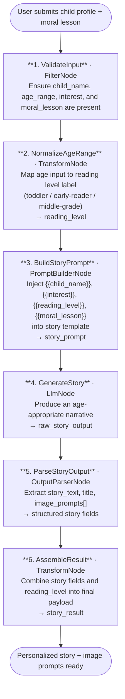

# 008 - Personalized Children's Story Generator

## Project Overview

This example builds a personalized children's story generator using ASP.NET Core Blazor Server and the **TwfAiFramework**. The application accepts a child's name, age range, interests, and a moral lesson, then produces a complete age-appropriate story along with a set of image-prompt suggestions that can be fed directly to an image-generation model.

The focus is on dynamic prompt composition. The workflow demonstrates how `PromptBuilderNode` with named template variables keeps story logic reusable and safe, while `OutputParserNode` separates the narrative text from the image-prompt metadata in a single structured response.

## Objective

Demonstrate a practical story-generation pipeline for parenting apps, education platforms, and digital storytelling tools:

- Use `PromptBuilderNode` with dynamic variables (`{{child_name}}`, `{{interest}}`, `{{age_range}}`, `{{moral_lesson}}`) to personalise every story without hard-coded prompt strings
- Use `LlmNode` to generate a rich, age-appropriate narrative in a single focused call
- Use `OutputParserNode` to extract the story body and image-prompt fields into a typed response object
- Use `TransformNode` to post-process the output and assemble the final payload
- Produce structured output that a UI can render immediately — story text in one field, ready-to-use image prompts in another

## End-to-End Workflow



## Why This Pattern Works

A prompt that tries to accept free-form child details, adapt reading level, inject a moral, and simultaneously output structured image prompts in a single unguarded string tends to drift — the moral lesson gets buried, the vocabulary overshoots the child's age, or the image prompts bleed into the narrative text.

Separating the work into discrete stages fixes this:

- **Variable safety** because `PromptBuilderNode` substitutes named placeholders rather than concatenating raw user input into the prompt string, which prevents prompt-injection via crafted child names or interests
- **Reading-level consistency** because the `TransformNode` normalisation step converts any age input into a stable label (`toddler`, `early-reader`, `middle-grade`) that the prompt template can reference predictably
- **Clean output extraction** because `OutputParserNode` enforces a JSON schema, so the UI always receives a typed `story_text` string and a typed `image_prompts` array regardless of how the LLM chose to format its response
- **Reusability** because swapping themes, moral lessons, or languages only requires changing the template variables, not rebuilding the pipeline

## Key Features

| Feature | Detail |
|---|---|
| **Dynamic variable injection** | `PromptBuilderNode` uses `{{child_name}}`, `{{interest}}`, `{{reading_level}}`, and `{{moral_lesson}}` to personalise every story |
| **Age-to-reading-level mapping** | `TransformNode` normalises age input to a stable label used throughout the prompt |
| **Structured output extraction** | `OutputParserNode` separates story title, narrative body, and image prompts into discrete fields |
| **Image-prompt generation** | Each story produces 2–4 scene-level image prompts suitable for illustration or image-generation APIs |
| **Injection-safe prompt assembly** | Named placeholders prevent user-supplied values from escaping the intended template context |
| **Provider flexibility** | Works with any OpenAI-compatible chat-completions endpoint |

## Recommended Inputs

| Input | Purpose | Example |
|---|---|---|
| `child_name` | Personalises the protagonist's name in the story | `Ava` |
| `age_range` | Determines vocabulary complexity and story length | `5-7` |
| `interest` | Shapes the story's theme and setting | `dinosaurs`, `space`, `baking` |
| `moral_lesson` | The value or lesson the story should convey | `sharing is caring`, `honesty builds trust` |
| `language` | Target language for the story output | `English`, `Spanish`, `French` |
| `story_length` | Approximate word count guidance | `short` (200–300 w), `medium` (400–600 w) |

## Expected Outputs

At the end of the pipeline the application returns a structured story payload:

```json
{
  "title": "Ava and the Sharing Star",
  "readingLevel": "early-reader",
  "storyText": "Once upon a time, in a land where dinosaurs roamed green valleys, there lived a little T-Rex named Ava...",
  "imaginePrompts": [
    "A cheerful young T-Rex named Ava standing in a sunny prehistoric valley, children's book illustration style, soft watercolour",
    "Ava sharing a large fruit with smaller dinosaur friends around a glowing star, warm colours, gentle lighting",
    "Close-up of Ava smiling with sparkle in her eyes, storybook art style, pastel tones"
  ],
  "moralHighlight": "Sharing with others makes everyone happy, including yourself.",
  "wordCount": 312
}
```

## Suggested Project Structure

```text
008_PersonalizedChildrenStoryGenerator/
├── Components/
│   ├── Pages/
│   │   ├── StoryGenerator.razor       # Child profile form and story display
│   │   └── StoryViewer.razor          # Rendered story with image-prompt panel
│   ├── Layout/
│   │   ├── MainLayout.razor
│   │   └── NavMenu.razor
│   └── App.razor
├── Controllers/
│   └── StoryController.cs             # POST /api/story/generate
├── Models/
│   ├── StoryRequest.cs                # child_name, age_range, interest, moral_lesson, language
│   ├── StoryResult.cs                 # title, story_text, image_prompts[], moral_highlight, word_count
│   └── ReadingLevel.cs                # Enum: Toddler, EarlyReader, MiddleGrade
├── Services/
│   └── StoryWorkflowService.cs        # Builds and runs the TwfAiFramework workflow
├── Constants.cs                       # Prompt templates and reading-level vocabulary guidelines
├── Program.cs                         # Dependency injection and app bootstrap
├── appsettings.json                   # Model endpoint defaults
└── appsettings.local.json             # Local API key overrides (gitignored)
```

## Setup

### 1. Configure the LLM Provider

Create `appsettings.local.json` in the project root:

```json
{
  "OpenAI": {
    "ApiKey": "sk-your-api-key",
    "Model": "gpt-4o-mini",
    "Endpoint": "https://api.openai.com/v1/chat/completions"
  }
}
```

Use any OpenAI-compatible provider. Only a chat-completions endpoint is required — no embeddings endpoint needed for this example.

### 2. Run the Application

```bash
dotnet run
```

The application will start at `https://localhost:5001`.

### 3. Typical Request Flow

1. User fills in the child's name, age, interest, and a moral lesson via the UI or sends a POST request.
2. The age input is normalised to a reading-level label.
3. `PromptBuilderNode` substitutes all variables into the story template.
4. The LLM generates a complete narrative with embedded image-prompt cues.
5. `OutputParserNode` extracts and validates the structured fields.
6. The assembled result is returned for rendering in the UI.

## TwfAiFramework Implementation Sketch

```csharp
var result = await Workflow.Create("ChildrenStoryGenerator")
    .UseLogger(logger)
    .AddNode(new FilterNode(data =>
        !string.IsNullOrWhiteSpace(data.Get<string>("child_name")) &&
        !string.IsNullOrWhiteSpace(data.Get<string>("interest")) &&
        !string.IsNullOrWhiteSpace(data.Get<string>("moral_lesson"))))
    .AddNode(new TransformNode(data =>
    {
        var age = data.Get<int>("age_range_min");
        var level = age <= 4 ? "toddler"
                  : age <= 8 ? "early-reader"
                             : "middle-grade";
        data.Set("reading_level", level);
        return data;
    }))
    .AddNode(new PromptBuilderNode(
        promptTemplate: Constants.StoryPromptTemplate,
        systemTemplate: Constants.StorySystemPrompt))
    .AddNode(new LlmNode(new LlmConfig
    {
        Provider = "openai",
        Model = "gpt-4o-mini",
        ApiKey = config["OpenAI:ApiKey"]!
    }))
    .AddNode(new OutputParserNode())
    .AddNode(new TransformNode(data =>
    {
        data.Set("story_result", StoryAssembler.Build(data));
        return data;
    }))
    .RunAsync(new WorkflowData()
        .Set("child_name", "Ava")
        .Set("interest", "dinosaurs")
        .Set("age_range_min", 6)
        .Set("moral_lesson", "sharing is caring")
        .Set("language", "English")
        .Set("story_length", "short"));
```

### Constants.StoryPromptTemplate (example)

```text
Write a {{story_length}} children's story for a {{reading_level}} reader.

The main character is a child named {{child_name}} who loves {{interest}}.
The story must clearly convey the moral lesson: "{{moral_lesson}}".
Write the story in {{language}}.

Return your response as JSON with these fields:
- "title": a creative story title
- "story_text": the full narrative
- "image_prompts": an array of 2–4 scene descriptions suitable for an illustration model
- "moral_highlight": a single closing sentence restating the moral in child-friendly language
```

## Prompt Strategy

### Story Prompt

The story prompt should instruct the model to:

- address the child by name and weave the chosen interest into the setting or protagonist naturally
- adjust sentence length, vocabulary, and narrative complexity to match the reading level label
- embed the moral lesson as an organic story outcome, not a tacked-on conclusion paragraph
- return output as structured JSON with clearly separated story and image-prompt fields

### Image-Prompt Sub-field

The image prompts should instruct the model to:

- describe each scene in visual, concrete terms that an image-generation model can act on directly
- include style guidance (e.g., watercolour, children's book illustration) consistent across all prompts
- keep each prompt self-contained so individual scenes can be generated independently

## Operational Considerations

### Reliability

- Add `NodeOptions.WithRetry(2)` around the `LlmNode` stage to handle transient API failures
- Validate that `OutputParserNode` returns a non-empty `story_text` field before assembling the final result
- Log the reading-level label and raw LLM output at each stage for auditability

### Content Safety

- Apply a content-safety filter or moderation check on the `moral_lesson` and `interest` inputs before they reach the prompt template, since these fields originate from user input
- Consider adding a post-generation moderation pass on `story_text` before returning results to the client
- Cap maximum `story_length` to control token costs and prevent excessively long outputs

### Quality

- Test prompt templates across all three reading levels with diverse interests to ensure vocabulary and sentence complexity scales correctly
- If image prompts are being passed to an external image-generation API, add a `FilterNode` to strip any phrases that violate that provider's content policy

## Good Fit Scenarios

This workflow is a good fit for:

- parenting and early-education apps that need on-demand personalised stories
- digital storytelling platforms offering illustrated e-books with AI-generated scenes
- classroom tools where teachers input a moral lesson and receive age-matched stories for a group
- gift or print-on-demand services producing custom illustrated storybooks

It is a weaker fit for interactive branching narratives or stories requiring multi-turn conversation with the child, which would benefit from a stateful `MaintainHistory` pattern instead.

## Possible Extensions

- Add a `ConditionNode` that routes based on reading level to use a smaller, faster model for toddler stories and a larger model for middle-grade content
- Use `Workflow.Parallel()` to generate multiple story variations in a single run, letting the user pick their favourite
- Add an `HttpRequestNode` to send each `image_prompt` directly to an image-generation API and return image URLs alongside the story text
- Extend `StoryRequest` with a `characters` list to support ensemble casts — siblings, friends, or pets — using additional template variables
- Store generated stories per child profile and use previous story summaries as context to maintain continuity across sessions

## Summary

Example 8 is a structured personalisation pipeline rather than a generic text-generation tool. The core pattern is intentionally simple and reusable:

1. validate and normalise inputs with `FilterNode` and `TransformNode`
2. compose a fully personalised prompt with `PromptBuilderNode` using named variables
3. generate the story with `LlmNode`
4. extract structured fields with `OutputParserNode`
5. assemble the final payload with `TransformNode`

That sequence maps directly to how real children's content platforms work: receive a profile, apply a template, generate, validate structure, and deliver. Each stage is independently testable, and swapping the moral lesson or interest requires no code changes — only different input values.
