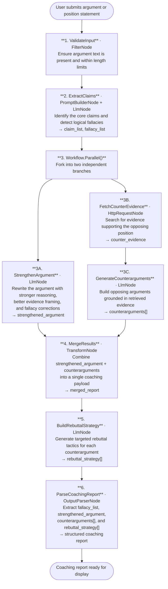

# 011 - Debate Coach & Argument Strengthener

## Project Overview

This example builds a debate coaching assistant using ASP.NET Core Blazor Server and the **TwfAiFramework**. The application accepts an argument or position statement, strengthens it with improved reasoning and evidence, and simultaneously generates counterarguments with evidence-backed rebuttals — all in a single workflow execution.

The focus is on parallel execution. The workflow demonstrates how `Workflow.Parallel()` runs two independent LLM branches concurrently — one to strengthen the user's argument, one to build the opposing case — then merges both outputs into a unified coaching report. This halves latency compared to running the branches sequentially.

## Objective

Demonstrate a practical argument analysis pipeline for debate training, legal preparation, and critical thinking tools:

- Use `Workflow.Parallel()` to run the argument-strengthening branch and the counterargument-generation branch simultaneously
- Use `HttpRequestNode` inside the counterargument branch to retrieve real-world evidence for each opposing point
- Use `LlmNode` with chain-of-thought reasoning to identify logical fallacies in the original argument
- Use `OutputParserNode` to extract structured feedback: fallacy list, strengthened argument, counterarguments, and rebuttal strategy
- Use `TransformNode` to merge the two parallel branch outputs into a single coaching report

## End-to-End Workflow

## Why This Pattern Works

Running the strengthening and counterargument branches sequentially would mean the user waits for two full LLM round-trips before seeing any output. Since neither branch depends on the other's result, running them in parallel cuts that wait time roughly in half.

The evidence retrieval step inside the counterargument branch is equally important: counterarguments generated from model memory alone tend to be generic. Grounding them in real search results produces specific, citable opposing points that genuinely challenge the user's position — which is what makes the coaching valuable.

- **Parallel execution** because `Workflow.Parallel()` dispatches both LLM branches at the same time, so total latency is bounded by the slower branch rather than the sum of both
- **Evidence-grounded opposition** because `HttpRequestNode` retrieves real sources before the counterargument LLM call, preventing generic or hallucinated opposing points
- **Fallacy transparency** because the claim-extraction stage explicitly names any logical fallacies before strengthening begins, so users understand *why* their original argument was weak
- **Unified output** because `TransformNode` merges the two parallel outputs into a single payload, keeping the UI simple and the downstream `OutputParserNode` schema consistent

## Key Features

| Feature | Detail |
|---|---|
| **Parallel branch execution** | `Workflow.Parallel()` runs the strengthen and counterargument branches concurrently, halving latency |
| **Real-time evidence retrieval** | `HttpRequestNode` fetches live search results for opposing evidence before the counterargument LLM call |
| **Logical fallacy detection** | Chain-of-thought `LlmNode` identifies fallacies (straw man, ad hominem, false dichotomy, etc.) in the original argument |
| **Structured rebuttal strategy** | Each counterargument is paired with a specific rebuttal tactic in the final report |
| **Parallel result merging** | `TransformNode` combines both branch outputs into a single structured payload |
| **Structured output enforcement** | `OutputParserNode` ensures the UI always receives typed lists for fallacies, counterarguments, and rebuttals |

## Recommended Inputs

| Input | Purpose | Example |
|---|---|---|
| `argument` | The position or argument to analyse and strengthen | `"Social media does more harm than good to teenagers"` |
| `debate_format` | Target format for output length and structure | `oxford`, `parliamentary`, `informal` |
| `evidence_depth` | How many search results to retrieve for counter-evidence | `3`, `5`, `10` |
| `target_audience` | Adjusts vocabulary and reasoning complexity in the output | `high school`, `university`, `professional` |
