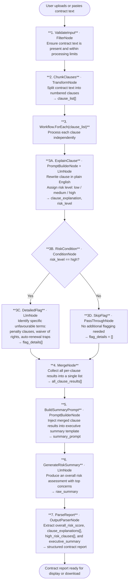

# 013 - Legal Contract Plain-Language Explainer

## Project Overview

This example builds a legal contract analysis tool using ASP.NET Core Blazor Server and the **TwfAiFramework**. The application accepts a full contract document, splits it into individual clauses, explains each one in plain English, flags unfavourable terms with a risk level, and then aggregates all per-clause results into a single risk summary using `MergeNode`.

The focus is on result aggregation after parallel iteration. The workflow demonstrates how `Workflow.ForEach()` distributes clause-level analysis across many `LlmNode` calls, and how `MergeNode` then collects those distributed results back into a unified document-level report — a pattern essential for any pipeline that processes a collection and needs a single structured output at the end.

## Objective

Demonstrate a practical contract review pipeline for legal tech tools, HR platforms, and consumer contract checkers:

- Use `TransformNode` to chunk a raw contract document into individual numbered clauses
- Use `Workflow.ForEach()` to process each clause independently through an explanation and risk-flagging pipeline
- Use `LlmNode` to rewrite each clause in plain English with a risk assessment
- Use `ConditionNode` to route high-risk clauses through an additional detailed-flag stage
- Use `MergeNode` to collect all per-clause results into a single aggregated payload
- Use a final `LlmNode` to generate an executive risk summary from the merged clause data

## End-to-End Workflow

## Why This Pattern Works

Processing a full contract in a single LLM call produces unreliable results at scale: long documents exceed context windows, per-clause reasoning becomes shallow, and risk flags get missed or conflated. Distributing the work clause-by-clause gives the LLM focused, bounded tasks — but creates the new problem of how to reassemble many individual outputs into one coherent report.

`MergeNode` solves that reassembly problem:

- **Scalability** because `Workflow.ForEach()` processes each clause independently, so the pipeline handles a 5-clause NDA and a 200-clause enterprise agreement with the same logic
- **Risk precision** because each clause is assessed in isolation, preventing a mildly risky early clause from lowering the apparent severity of a genuinely dangerous later one
- **Selective depth** because `ConditionNode` only routes high-risk clauses through the detailed-flag stage, avoiding unnecessary LLM calls on low-risk boilerplate
- **Clean aggregation** because `MergeNode` gathers all per-clause results into a typed list before the summary stage, so the executive summary LLM call has complete structured context rather than raw text fragments

## Key Features

| Feature | Detail |
|---|---|
| **Clause-level processing** | `Workflow.ForEach()` distributes analysis so each clause receives its own focused LLM call |
| **Three-tier risk classification** | Each clause is rated low / medium / high before any detailed flagging |
| **Selective deep-flag routing** | `ConditionNode` sends only high-risk clauses through the detailed unfavourable-term extractor |
| **Result aggregation via MergeNode** | `MergeNode` collects all per-clause outputs into a single typed list for the summary stage |
| **Executive risk summary** | A final `LlmNode` synthesises the merged clause data into an overall risk score and top-concern list |
| **Structured output enforcement** | `OutputParserNode` ensures the UI always receives typed arrays for clause explanations and flags |

## Recommended Inputs

| Input | Purpose | Example |
|---|---|---|
| `contract_text` | The full contract document to analyse | Paste of an NDA, employment contract, or SaaS terms |
| `contract_type` | Helps the LLM apply domain-appropriate risk rules | `NDA`, `employment`, `SaaS`, `lease`, `service agreement` |
| `party_role` | Which party the user represents — shapes what counts as unfavourable | `employee`, `vendor`, `customer`, `tenant` |
| `jurisdiction` | Adds jurisdiction-specific legal context to explanations | `England and Wales`, `California`, `Singapore` |
| `risk_threshold` | Minimum risk level to include in the high-risk summary | `medium`, `high` |
