# 015 - Product Description Generator for E-Commerce

## Project Overview

This example builds a bulk product description generator using ASP.NET Core Blazor Server and the **TwfAiFramework**. The application accepts a list of SKUs with product attributes, generates SEO-optimised descriptions in multiple tones for each SKU, and paces its API calls using `DelayNode.RateLimitDelay()` to avoid hitting provider rate limits during large batch runs.

The focus is on controlled bulk execution. The workflow demonstrates how `Workflow.ForEach()` scales across hundreds of SKUs while `DelayNode.RateLimitDelay()` inserts a configurable pause between each generation call — essential for production workloads where exceeding the API rate limit would cause failures mid-batch and require costly restarts.

## Objective

Demonstrate a practical bulk content generation pipeline for e-commerce platforms, product catalogue tools, and marketing automation:

- Use `TransformNode` to parse and normalise an uploaded SKU list into a structured product attribute array
- Use `Workflow.ForEach()` to process each SKU independently through the description generation pipeline
- Use `PromptBuilderNode` with a tone-selection variable to generate short, long, and bullet-point descriptions from a single template
- Use `DelayNode.RateLimitDelay()` to insert a configurable pause between SKU calls and stay within API rate limits
- Use `OutputParserNode` to extract the three description variants into typed fields for each SKU
- Use a final `TransformNode` to assemble all per-SKU results into a downloadable catalogue payload

## End-to-End Workflow

```mermaid
flowchart TD
    START([User uploads SKU list with product attributes]) --> Validate

    Validate["**1. ValidateInput** · FilterNode\nEnsure SKU list is present, parseable, and within batch size limits"]

    Validate --> ParseSkuList

    ParseSkuList["**2. ParseSkuList** · TransformNode\nNormalise CSV / JSON input into a typed product_list[]\nEach entry: sku_id, name, category, attributes[], target_audience\n→ product_list[]"]

    ParseSkuList --> ForEach

    ForEach["**3. Workflow.ForEach(product_list)**\nProcess each SKU independently"]

    ForEach --> RateLimitDelay

    RateLimitDelay["**3A. RateLimitDelay** · DelayNode.RateLimitDelay()\nInsert configurable pause between API calls\nPrevents rate-limit errors mid-batch\n→ (passthrough — no data transformation)"]

    RateLimitDelay --> BuildPrompt

    BuildPrompt["**3B. BuildDescriptionPrompt** · PromptBuilderNode\nInject {{sku_name}}, {{attributes}}, {{category}},\n{{target_audience}}, and {{tone}} into description template\n→ description_prompt"]

    BuildPrompt --> GenerateDescription

    GenerateDescription["**3C. GenerateDescription** · LlmNode\nProduce short, long, and bullet-point description variants\nin the specified tone\n→ raw_description_output"]

    GenerateDescription --> ParseDescription

    ParseDescription["**3D. ParseDescription** · OutputParserNode\nExtract short_description, long_description,\nbullet_points[], and meta_description\n→ structured_sku_description"]

    ParseDescription --> AssembleResults

    AssembleResults["**4. AssembleResults** · TransformNode\nCollect all per-SKU descriptions into a single catalogue payload\n→ catalogue_output"]

    AssembleResults --> END([Full catalogue with descriptions ready for export or CMS upload])
```

## Why This Pattern Works

Bulk LLM workloads fail in two predictable ways: they exceed API rate limits mid-batch, or they produce inconsistent output formats that break downstream CMS imports. This pipeline addresses both.

`DelayNode.RateLimitDelay()` is the key addition here. Without it, a `Workflow.ForEach()` over a large SKU list dispatches requests as fast as the framework can process them — which triggers HTTP 429 responses from the provider, halts the batch, and requires manual intervention to resume. Inserting a rate-limit delay node makes the batch self-regulating:

- **Batch reliability** because `DelayNode.RateLimitDelay()` prevents HTTP 429 errors by spacing requests within the provider's allowed throughput window
- **Output consistency** because `OutputParserNode` enforces a fixed JSON schema per SKU, so every description arrives with the same typed fields regardless of how the LLM chose to format its response
- **Tone flexibility** because the `{{tone}}` variable in `PromptBuilderNode` allows the same template to produce formal, casual, or luxury descriptions without duplicating pipeline logic
- **CMS-ready output** because the final `TransformNode` assembles all per-SKU results into a single structured payload that can be directly uploaded to Shopify, Magento, or any headless CMS

## Key Features

| Feature | Detail |
|---|---|
| **Controlled bulk execution** | `DelayNode.RateLimitDelay()` spaces API calls to stay within provider rate limits across large SKU batches |
| **Multi-tone description generation** | `{{tone}}` variable in `PromptBuilderNode` produces formal, casual, technical, or luxury variants from one template |
| **Three description formats per SKU** | Each SKU gets a short tagline, a long paragraph, and a bullet-point list in a single LLM call |
| **SEO meta description extraction** | `OutputParserNode` also extracts a ready-to-use meta description for each product |
| **Structured per-SKU output** | Each SKU result is a typed object with consistent field names for reliable CMS import |
| **Configurable batch pacing** | Rate-limit delay interval is set via configuration, not hardcoded — adjustable per provider tier |

## Recommended Inputs

| Input | Purpose | Example |
|---|---|---|
| `sku_list` | CSV or JSON file containing product SKUs and attributes | `[{sku: "ABC-001", name: "Merino Wool Sweater", attributes: ["navy", "XL", "machine washable"]}]` |
| `tone` | Desired tone for all generated descriptions | `professional`, `casual`, `luxury`, `playful` |
| `target_audience` | Adjusts vocabulary and benefit framing in descriptions | `parents`, `fitness enthusiasts`, `enterprise buyers` |
| `language` | Output language for generated descriptions | `English`, `German`, `French` |
| `rate_limit_delay_ms` | Milliseconds to wait between each API call | `500`, `1000`, `2000` |
| `max_batch_size` | Maximum number of SKUs to process in one run | `50`, `100`, `500` |
