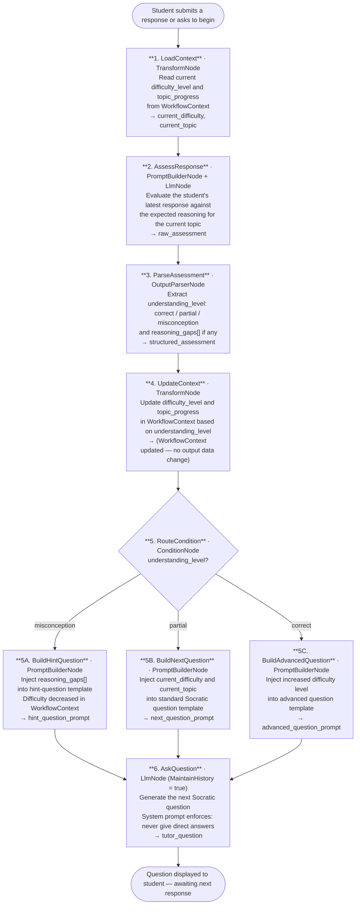

# 019 - Socratic Tutoring System

## Project Overview

This example builds an adaptive Socratic tutoring assistant using ASP.NET Core Blazor Server and the **TwfAiFramework**. The application teaches a chosen subject entirely through questions — never giving direct answers — and adapts the difficulty of its questions based on the student's responses. Difficulty level and session progress are tracked in `WorkflowContext` global state rather than the prompt, keeping the conversation history clean and the state management explicit.

The focus is on persistent cross-turn state. The workflow demonstrates how `WorkflowContext` stores and updates a student's difficulty level and topic progress across every turn of a multi-turn conversation, allowing `ConditionNode` to make routing decisions based on accumulated session data rather than re-inferring state from the conversation history on every call.

## Objective

Demonstrate a practical adaptive tutoring pipeline for education platforms, corporate learning tools, and self-paced study apps:

- Use a multi-turn `LlmNode` with `MaintainHistory = true` to hold the full Socratic conversation
- Use `OutputParserNode` to extract a structured understanding assessment from each student response (correct reasoning, partial understanding, misconception)
- Use `WorkflowContext` to store and update the student's current `difficulty_level` and `topic_progress` across turns without polluting the conversation history
- Use `ConditionNode` to route turns that indicate confusion into a hint branch, and turns showing mastery into a difficulty-increase branch
- Use `PromptBuilderNode` to inject the current `difficulty_level` from `WorkflowContext` into the next question template, ensuring the question always matches the student's demonstrated level
- Enforce a never-answer guardrail in every `LlmNode` system prompt to prevent the tutor from breaking the Socratic method

## End-to-End Workflow

## Why This Pattern Works

A naive Socratic tutor that tracks difficulty purely through the conversation history degrades quickly. As the history grows longer, the model must re-infer the student's level from an increasingly large context window on every turn — which is slow, token-expensive, and prone to drift as earlier exchanges get truncated. Storing state in `WorkflowContext` instead keeps the inference task small and deterministic:

- **Stable adaptive state** because `WorkflowContext` holds `difficulty_level` and `topic_progress` as explicit typed values, not as patterns the model must re-detect in a long conversation history
- **Clean conversation history** because the system prompt and question prompts only receive the current difficulty level as a variable — the history stays focused on the dialogue, not on state bookkeeping
- **Deterministic routing** because `ConditionNode` reads `understanding_level` from the structured `OutputParserNode` output rather than asking the LLM to decide its own next step, preventing the tutor from accidentally slipping into answer-giving mode
- **Never-answer guardrail** because the system prompt on every `LlmNode` call explicitly forbids direct answers, and `ConditionNode` routing ensures even a confused student receives a simpler question rather than an explanation
- **Difficulty continuity** because `WorkflowContext` persists across every turn of the session, so a student who masters a topic will reliably receive harder questions and one who struggles will reliably receive easier ones — regardless of how long the conversation has been running

## Key Features

| Feature | Detail |
|---|---|
| **WorkflowContext state tracking** | `difficulty_level` and `topic_progress` are stored in `WorkflowContext`, updated each turn, and injected into prompts via variables |
| **Multi-turn Socratic conversation** | `LlmNode` with `MaintainHistory = true` holds the full dialogue without exposing state management to the conversation |
| **Structured understanding assessment** | `OutputParserNode` extracts `understanding_level` (correct / partial / misconception) and `reasoning_gaps[]` from every student response |
| **Three-way adaptive routing** | `ConditionNode` routes each turn to a hint, neutral, or advanced question branch based on assessed understanding |
| **Never-answer guardrail** | Every `LlmNode` system prompt includes an explicit prohibition on giving direct answers, enforcing the Socratic method |
| **Configurable difficulty scale** | Difficulty levels (1–5) are defined in configuration and map to vocabulary complexity, abstraction depth, and question length |

## Recommended Inputs

| Input | Purpose | Example |
|---|---|---|
| `subject` | The topic the tutoring session covers | `photosynthesis`, `Newton's laws`, `SQL joins`, `French Revolution` |
| `student_level` | Starting difficulty level for the session | `beginner`, `intermediate`, `advanced` (maps to 1–5 scale) |
| `session_goal` | The concept the student should understand by the end | `"Understand why plants need sunlight"` |
| `hint_threshold` | Number of consecutive partial/misconception responses before a hint is offered | `2`, `3` |
| `max_turns` | Maximum number of question-response turns before a session summary is generated | `10`, `20` |
