# 021 - Multi-Document Research Synthesizer

## Project Overview

This example builds a **multi-document research synthesizer** using ASP.NET Core Blazor Server and the **TwfAiFramework**. The application ingests 50+ research papers into a semantic vector index, then answers cross-cutting questions with inline citations — surfacing both agreements and contradictions across the corpus.

Users upload or reference a collection of PDF/text research papers. The application chunks and embeds them into a vector store. At query time, relevant chunks are retrieved semantically, injected into a grounded prompt, and an LLM produces a synthesized answer with source citations. A contradiction-detection pass then highlights claims that conflict across sources.

## Objective

Demonstrate a production-grade Retrieval-Augmented Generation (RAG) pipeline for academic and research use cases:

- Use `EmbeddingNode` to chunk and embed research papers into a persistent vector index at ingest time
- Use `HttpRequestNode` for semantic vector store retrieval at query time
- Use `PromptBuilderNode` to inject retrieved chunks into a grounded generation prompt
- Use `OutputParserNode` to extract structured citations from the LLM response
- Use a second `LlmNode` pass to detect and surface agreements and contradictions across cited sources

## End-to-End Workflow

```mermaid
flowchart TD
    START([User submits a research question]) --> ValidateInput

    ValidateInput["**1. ValidateInput** · FilterNode\nEnsure question text is non-empty\nand the index contains at least one document"]

    ValidateInput --> EmbedQuery

    EmbedQuery["**2. EmbedQuery** · EmbeddingNode\nEmbed the user question into a dense vector\nusing text-embedding-3-small\n→ query_vector"]

    EmbedQuery --> RetrieveChunks

    RetrieveChunks["**3. RetrieveChunks** · HttpRequestNode\nQuery the vector store (top_k = 12)\nwith query_vector\n→ retrieved_chunks [ ]"]

    RetrieveChunks --> BuildGroundedPrompt

    BuildGroundedPrompt["**4. BuildGroundedPrompt** · PromptBuilderNode\nInject retrieved_chunks as numbered context blocks\nand the original question into the generation template\n→ grounded_prompt"]

    BuildGroundedPrompt --> SynthesizeAnswer

    SynthesizeAnswer["**5. SynthesizeAnswer** · LlmNode\nGenerate a synthesized answer with inline citations\n→ raw_answer"]

    SynthesizeAnswer --> ExtractCitations

    ExtractCitations["**6. ExtractCitations** · OutputParserNode\nParse raw_answer into structured fields:\nanswer_text, citations [ ]\n→ structured_response"]

    ExtractCitations --> DetectContradictions

    DetectContradictions["**7. DetectContradictions** · LlmNode\nCompare cited claims across sources,\nidentify agreements and contradictions\n→ contradiction_report"]

    DetectContradictions --> MergeOutput

    MergeOutput["**8. MergeOutput** · MergeNode\nCombine structured_response and contradiction_report\ninto the final response payload"]

    MergeOutput --> END([Synthesized answer with citations and contradiction analysis returned])
```



### Ingest Workflow (run once per paper batch)


## Why This Pattern Works

A naive approach — stuffing all papers into a single prompt — is infeasible at scale and yields unfocused, uncited answers. Separating embedding, retrieval, grounded generation, citation extraction, and contradiction detection into distinct pipeline stages keeps each step precise and independently tunable.

That separation improves:

- **Accuracy** because the LLM operates only on the top-k most relevant chunks rather than noisy full-document context
- **Traceability** because `OutputParserNode` forces every claim to carry a source reference — the model cannot answer without citing
- **Contradiction visibility** because a dedicated second-pass `LlmNode` compares cited sources explicitly, rather than relying on the generation stage to self-report disagreements
- **Scalability** because `Workflow.Parallel()` embeds hundreds of chunks concurrently at ingest time, keeping index build time proportional to batch size rather than sequential
- **Maintainability** because adding a new paper requires only re-running the ingest workflow — the query pipeline needs no changes

## Key Features

| Feature | Detail |
|---|---|
| **Semantic ingest pipeline** | Chunks and embeds 50+ papers concurrently via `Workflow.Parallel()` + `EmbeddingNode` |
| **Vector store retrieval** | Top-k semantic search returns the most relevant passages across the entire corpus |
| **Grounded answer generation** | `PromptBuilderNode` injects retrieved chunks as numbered context; the LLM is instructed to answer only from provided context |
| **Structured citation extraction** | `OutputParserNode` parses every answer into `answer_text` + `citations[]` with paper title, authors, and page reference |
| **Contradiction detection** | A second `LlmNode` pass explicitly identifies where cited sources agree or contradict each other |
| **Configurable retrieval depth** | `top_k` is configurable — increase for broad synthesis, decrease for focused fact retrieval |
| **Metadata-rich index** | Each vector carries paper title, authors, publication year, and page number for citation formatting |

## Inputs

### Query Inputs (provided in the UI each time)

| Input | Purpose | Example |
|---|---|---|
| `question` | The cross-cutting research question | "What do these papers conclude about transformer scaling laws?" |
| `top_k` | Number of chunks to retrieve from the vector store | `12` |
| `corpus_filter` | Optional metadata filter to scope retrieval to a subset of papers | `{ "year": { "$gte": 2022 } }` |

### Ingest Inputs (provided once per document batch)

| Input | Purpose | Example |
|---|---|---|
| `documents` | List of research paper files (PDF or plain text) | `["attention_is_all_you_need.pdf", "gpt4_report.pdf"]` |
| `chunk_size` | Target token count per chunk | `512` |
| `chunk_overlap` | Overlap between consecutive chunks (in tokens) | `64` |

## Expected Output

```json
{
  "answer": "Across the reviewed papers, transformer scaling follows a power-law relationship between model size and performance. Kaplan et al. (2020) and Hoffmann et al. (2022) agree that compute-optimal training requires scaling data and parameters proportionally, though they disagree on the optimal ratio.",
  "citations": [
    {
      "paper_id": "kaplan2020",
      "title": "Scaling Laws for Neural Language Models",
      "authors": ["Kaplan, J.", "McCandlish, S."],
      "year": 2020,
      "page": 4,
      "excerpt": "Performance improves predictably as a power-law with model size, dataset size, and compute."
    },
    {
      "paper_id": "hoffmann2022",
      "title": "Training Compute-Optimal Large Language Models",
      "authors": ["Hoffmann, J.", "Borgeaud, S."],
      "year": 2022,
      "page": 7,
      "excerpt": "For a given compute budget, model size and training tokens should be scaled equally."
    }
  ],
  "contradictions": [
    {
      "claim": "Optimal compute allocation ratio between model size and training tokens",
      "source_a": "kaplan2020",
      "source_b": "hoffmann2022",
      "summary": "Kaplan et al. recommend allocating more compute to model size; Hoffmann et al. argue equal scaling of parameters and tokens is optimal."
    }
  ],
  "retrieved_chunk_count": 12,
  "query_answered_at": "2026-04-24T10:30:00Z"
}
```

## Suggested Project Structure

```text
021_MultiDocumentResearchSynthesizer/
├── Components/
│   ├── Pages/
│   │   ├── Query.razor                      # Research question input and synthesized answer display
│   │   └── Ingest.razor                     # Paper upload form and ingest progress indicator
│   ├── Layout/
│   │   ├── MainLayout.razor
│   │   └── NavMenu.razor
│   └── App.razor
├── Controllers/
│   ├── QueryController.cs                   # POST /api/research/query
│   └── IngestController.cs                  # POST /api/research/ingest
├── Models/
│   ├── ResearchQuery.cs                     # question, top_k, corpus_filter
│   ├── IngestRequest.cs                     # documents, chunk_size, chunk_overlap
│   ├── SynthesizedAnswer.cs                 # answer, citations[], contradictions[], metadata
│   ├── Citation.cs                          # paper_id, title, authors, year, page, excerpt
│   └── Contradiction.cs                     # claim, source_a, source_b, summary
├── Services/
│   ├── QueryWorkflowService.cs              # Builds and runs the query-time RAG workflow
│   ├── IngestWorkflowService.cs             # Builds and runs the ingest workflow
│   ├── ChunkingService.cs                   # Splits documents into overlapping token chunks
│   └── VectorStoreClient.cs                 # Wraps vector store HTTP API calls
├── Constants.cs                             # Prompt templates for synthesis and contradiction detection
├── Program.cs                               # Dependency injection and app bootstrap
├── appsettings.json                         # Model and vector store defaults
└── appsettings.local.json                   # Local API key overrides (gitignored)
```

## Setup

### 1. Configure the LLM and Embedding Providers

Create `appsettings.local.json` in the project root:

```json
{
  "OpenAI": {
    "ApiKey": "sk-your-api-key",
    "ChatModel": "gpt-4o",
    "EmbeddingModel": "text-embedding-3-small",
    "Endpoint": "https://api.openai.com/v1"
  },
  "VectorStore": {
    "Endpoint": "https://your-vector-store/query",
    "UpsertEndpoint": "https://your-vector-store/upsert",
    "ApiKey": "your-vector-store-api-key",
    "IndexName": "research-papers"
  }
}
```

Compatible vector stores include Pinecone, Qdrant, Azure AI Search, and Weaviate. Update `VectorStoreClient.cs` to match your provider's request/response schema.

### 2. Ingest Your Research Papers

Navigate to the Ingest page, upload your PDF or plain-text research papers, and click Index. The ingest workflow chunks, embeds, and upserts all documents into the configured vector store. Progress is displayed per document.

Alternatively, trigger ingest programmatically:

```bash
curl -X POST https://localhost:5001/api/research/ingest \
  -F "files=@attention_is_all_you_need.pdf" \
  -F "files=@gpt4_report.pdf" \
  -F "chunk_size=512" \
  -F "chunk_overlap=64"
```

### 3. Run the Application

```bash
dotnet run
```

The application starts at `https://localhost:5001`.

### 4. Typical Query Flow

1. User opens the Query page and types a cross-cutting research question.
2. The workflow embeds the question and retrieves the top-k most semantically relevant chunks from the vector store.
3. Retrieved chunks are injected into a grounded prompt; the LLM generates a synthesized answer with inline citations.
4. `OutputParserNode` extracts the structured `citations[]` array from the raw answer.
5. A second LLM pass compares the cited sources and produces a `contradictions[]` report.
6. The final response — answer, citations, and contradiction analysis — is displayed in the UI.

## TwfAiFramework Implementation Sketch

```csharp
// Query workflow
var result = await Workflow.Create("ResearchSynthesizer")
    .UseLogger(logger)
    // 1. Validate input
    .AddNode(new FilterNode(data =>
        !string.IsNullOrWhiteSpace(data.Get<string>("question"))))
    // 2. Embed the user question
    .AddNode(new EmbeddingNode(new EmbeddingConfig
    {
        Model  = config["OpenAI:EmbeddingModel"]!,
        ApiKey = config["OpenAI:ApiKey"]!
    }))
    // 3. Retrieve top-k relevant chunks from the vector store
    .AddNode(new HttpRequestNode("RetrieveChunks", new HttpRequestConfig
    {
        Method      = "POST",
        UrlTemplate = config["VectorStore:Endpoint"]!,
        Headers     = new() { ["Api-Key"] = config["VectorStore:ApiKey"]! },
        Body        = new { top_k = request.TopK, filter = request.CorpusFilter }
    }))
    // 4. Build a grounded prompt from retrieved chunks
    .AddNode(new PromptBuilderNode(
        promptTemplate: Constants.SynthesisPrompt,
        systemTemplate: Constants.SynthesisSystemPrompt))
    // 5. Generate synthesized answer with inline citations
    .AddNode(new LlmNode(new LlmConfig
    {
        Provider = "openai",
        Model    = config["OpenAI:ChatModel"]!,
        ApiKey   = config["OpenAI:ApiKey"]!
    }))
    // 6. Extract structured citations from the raw answer
    .AddNode(new OutputParserNode(fieldMapping: new()
    {
        ["answer"]    = "answer",
        ["citations"] = "citations"
    }))
    // 7. Detect agreements and contradictions across cited sources
    .AddNode(new LlmNode(new LlmConfig
    {
        Provider     = "openai",
        Model        = config["OpenAI:ChatModel"]!,
        ApiKey       = config["OpenAI:ApiKey"]!,
        SystemPrompt = Constants.ContradictionDetectionPrompt
    }, name: "DetectContradictions"))
    // 8. Merge synthesis and contradiction report into final output
    .AddNode(new MergeNode(fields: new[] { "answer", "citations", "contradictions" }))
    .RunAsync(new WorkflowData()
        .Set("question", request.Question)
        .Set("top_k",    request.TopK));

// Ingest workflow (run per document batch)
await Workflow.Create("PaperIngest")
    .UseLogger(logger)
    .AddNode(new TransformNode(data =>
    {
        data.Set("chunks", chunkingService.Chunk(
            data.Get<string>("document_text"),
            chunkSize:    request.ChunkSize,
            chunkOverlap: request.ChunkOverlap));
        return data;
    }))
    .AddNode(new EmbeddingNode(new EmbeddingConfig
    {
        Model  = config["OpenAI:EmbeddingModel"]!,
        ApiKey = config["OpenAI:ApiKey"]!
    }), parallelOptions: Workflow.Parallel())
    .AddNode(new HttpRequestNode("StoreVectors", new HttpRequestConfig
    {
        Method      = "POST",
        UrlTemplate = config["VectorStore:UpsertEndpoint"]!,
        Headers     = new() { ["Api-Key"] = config["VectorStore:ApiKey"]! }
    }))
    .RunAsync(new WorkflowData()
        .Set("document_text", documentText)
        .Set("metadata", paperMetadata));
```

## Prompt Strategy

### Synthesis System Prompt

```
You are a research synthesis assistant. Answer the user's question using ONLY the numbered context blocks provided.
For every claim you make, cite the source using [source_N] notation corresponding to the context block number.
If the context does not contain sufficient information to answer the question, state that explicitly.
Do not speculate or use outside knowledge.
```

### Synthesis Prompt Template

```
Context blocks retrieved from the research corpus:

{{retrieved_chunks}}

Research question: {{question}}

Provide a comprehensive synthesized answer with inline citations in [source_N] format.
After the answer, output a JSON block under the key "citations" listing each cited source with:
paper_id, title, authors, year, page, and the exact excerpt used.
```

### Contradiction Detection Prompt

```
You are given a synthesized research answer and its citations.
Identify any claims where the cited sources contradict or significantly disagree with each other.
For each contradiction found, output a JSON entry with: claim, source_a, source_b, and a brief summary of the disagreement.
If no contradictions exist, return an empty array.
```

## Operational Considerations

### Reliability

- Add `NodeOptions.WithRetry(3)` around both `LlmNode` and `HttpRequestNode` calls to handle transient API and vector store timeouts
- Log embedding dimensions and retrieved chunk counts at `Debug` level to detect index drift after model upgrades
- Set a hard limit on `top_k` (e.g., max 20) to prevent runaway context sizes crashing the LLM call

### Chunking Quality

- 512-token chunks with 64-token overlap preserve enough context for accurate embedding while keeping retrieval results focused
- Preserve section headers in chunks — prepending the paper title and section heading to each chunk significantly improves retrieval precision
- For PDFs, strip headers, footers, and page numbers before chunking to reduce noise in retrieved excerpts

### Index Management

- Store `paper_id`, `title`, `authors`, and `year` as filterable metadata fields in the vector store to enable `corpus_filter` scoping
- Assign deterministic IDs to chunks (`{paper_id}_chunk_{index}`) so re-ingesting a paper performs an upsert rather than creating duplicates
- Version the embedding model in index metadata — if you upgrade from `text-embedding-3-small` to a newer model, re-embed the entire corpus to avoid mixed-distance-space comparisons

### Citation Quality

- Instruct the LLM to include the verbatim excerpt that supports each citation — this makes hallucination auditing straightforward
- Post-process citations to verify the `paper_id` exists in your index before returning the response

## Good Fit Scenarios

This workflow is a good fit for:

- Research teams needing to synthesize findings across large paper collections quickly
- Systematic review workflows where citation traceability is mandatory
- Competitive intelligence pipelines ingesting analyst reports, white papers, or patent filings
- Academic literature review assistance where contradiction detection adds immediate value

It is **not** a good fit for:

- Single-document Q&A (use a simpler single-pass RAG without the ingest pipeline)
- Real-time data sources where a persistent vector index is impractical
- Use cases where the answer must derive from the full paper text rather than sampled chunks (consider a map-reduce summarization pattern instead)
