# 025 - Resume Parser & Candidate Ranker

## Project Overview

This example builds a **resume parser and candidate ranker** using ASP.NET Core Blazor Server and the **TwfAiFramework**. The application accepts resumes in any format (PDF, DOCX, plain text), parses them into structured candidate profiles, scores each candidate semantically against a job description, and generates tailored interview question suggestions.

Recruiters paste or upload a job description alongside a batch of resumes. The application parses every resume into a structured profile, embeds both the profiles and the job description, computes a semantic similarity score for each candidate, ranks the list, and suggests targeted interview questions for the top candidates — all in a single end-to-end workflow.

## Objective

Demonstrate a document-intelligence pipeline for HR and recruiting use cases:

- Use `HttpRequestNode` to call a document parsing API that converts resumes from any format into plain text
- Use `EmbeddingNode` to embed both candidate profiles and the job description for semantic scoring
- Use `Workflow.ForEach()` to process every resume independently through the same parsing and scoring sub-pipeline
- Use `OutputParserNode` to extract structured candidate profiles (name, skills, experience, education) from raw resume text
- Use an `LlmNode` pass per top candidate to generate personalised interview questions aligned to the role requirements

## End-to-End Workflow

```mermaid
flowchart TD
    START([Recruiter submits job description + resume files]) --> ValidateInput

    ValidateInput["**1. ValidateInput** · FilterNode\nEnsure job description is non-empty\nand at least one resume is provided"]

    ValidateInput --> EmbedJobDescription

    EmbedJobDescription["**2. EmbedJobDescription** · EmbeddingNode\nEmbed the job description into a dense vector\nusing text-embedding-3-small\n→ job_vector"]

    EmbedJobDescription --> ParseResumes

    ParseResumes["**3. ParseResumes** · HttpRequestNode + Workflow.ForEach()\nFor each resume, call the document parsing API\nto extract plain-text content\n→ resume_texts [ ]"]

    ParseResumes --> ExtractProfiles

    ExtractProfiles["**4. ExtractProfiles** · OutputParserNode + Workflow.ForEach()\nFor each resume_text, extract structured fields:\nname, email, skills [], experience [], education []\n→ candidate_profiles [ ]"]

    ExtractProfiles --> EmbedProfiles

    EmbedProfiles["**5. EmbedProfiles** · EmbeddingNode + Workflow.ForEach()\nEmbed each candidate profile into a dense vector\n→ profile_vectors [ ]"]

    EmbedProfiles --> ScoreCandidates

    ScoreCandidates["**6. ScoreCandidates** · TransformNode\nCompute cosine similarity between each\nprofile_vector and job_vector\n→ scored_candidates [ ]"]

    ScoreCandidates --> RankCandidates

    RankCandidates["**7. RankCandidates** · TransformNode\nSort scored_candidates by similarity score descending\n→ ranked_candidates [ ]"]

    RankCandidates --> GenerateInterviewQuestions

    GenerateInterviewQuestions["**8. GenerateInterviewQuestions** · LlmNode + Workflow.ForEach(top N)\nFor each top-ranked candidate, generate\ntailored interview questions based on their\nprofile and the job requirements\n→ interview_questions [ ]"]

    GenerateInterviewQuestions --> MergeOutput

    MergeOutput["**9. MergeOutput** · MergeNode\nCombine ranked_candidates and interview_questions\ninto the final response payload"]

    MergeOutput --> END([Ranked candidates with scores and interview questions returned])
```



## Why This Pattern Works

A naive approach — asking a single LLM call to parse, score, and rank all resumes at once — does not scale beyond a handful of documents and produces inconsistently structured output. Separating document parsing, structured extraction, semantic embedding, scoring, ranking, and question generation into discrete pipeline stages solves these problems:

- **Format agnosticism** because `HttpRequestNode` delegates format conversion (PDF, DOCX, etc.) to a specialised parsing API; the rest of the pipeline operates on plain text
- **Consistent structure** because `OutputParserNode` enforces a fixed schema for every candidate profile regardless of resume style
- **Semantic accuracy** because embedding-based scoring captures conceptual alignment between a candidate's experience and the role — not just keyword overlap
- **Scalability** because `Workflow.ForEach()` processes every resume through the same sub-pipeline independently, making throughput proportional to the number of resumes
- **Relevance** because interview questions are generated per candidate using their specific profile alongside the job description, producing targeted rather than generic questions
- **Maintainability** because each stage is independently configurable — swap the parsing API, change the embedding model, or adjust the top-N cutoff without touching other nodes

## Key Features

| Feature | Detail |
|---|---|
| **Any-format resume ingestion** | `HttpRequestNode` calls a document parsing API to convert PDF, DOCX, and plain-text resumes into a common text representation |
| **Structured profile extraction** | `OutputParserNode` parses each resume into a consistent schema: name, contact, skills, work experience, and education |
| **Semantic candidate scoring** | `EmbeddingNode` embeds both the job description and each profile; cosine similarity produces a 0–1 relevance score |
| **Parallel processing per candidate** | `Workflow.ForEach()` fans out parsing, extraction, and embedding over all submitted resumes concurrently |
| **Ranked shortlist** | Candidates are sorted by semantic similarity score and returned as an ordered list with score and profile details |
| **Tailored interview questions** | For each top-ranked candidate, an `LlmNode` generates role-specific questions grounded in the candidate's actual experience |
| **Configurable shortlist size** | `top_n` controls how many candidates receive interview question generation |

## Inputs

| Input | Purpose | Example |
|---|---|---|
| `job_description` | Full text of the job posting or role requirements | `"We are looking for a Senior Backend Engineer with 5+ years of experience in distributed systems..."` |
| `resumes` | List of resume files (PDF, DOCX, or plain text) | `["alice_cv.pdf", "bob_resume.docx", "carol.txt"]` |
| `top_n` | Number of top-ranked candidates to generate interview questions for | `5` |
| `similarity_threshold` | Minimum semantic similarity score to include a candidate in the shortlist | `0.65` |

## Expected Output

```json
{
  "ranked_candidates": [
    {
      "rank": 1,
      "similarity_score": 0.91,
      "profile": {
        "name": "Alice Nguyen",
        "email": "alice@example.com",
        "skills": ["Go", "Kubernetes", "gRPC", "PostgreSQL"],
        "experience": [
          {
            "title": "Senior Software Engineer",
            "company": "Acme Corp",
            "duration_years": 4,
            "summary": "Led backend infrastructure migration to microservices on Kubernetes."
          }
        ],
        "education": [
          {
            "degree": "B.Sc. Computer Science",
            "institution": "MIT",
            "year": 2018
          }
        ]
      },
      "interview_questions": [
        "Can you walk us through the microservices migration you led at Acme Corp and the key architectural decisions you made?",
        "How have you approached gRPC service versioning in production, and what trade-offs did you encounter?",
        "Describe a situation where a Kubernetes deployment caused an outage and how you diagnosed and resolved it."
      ]
    },
    {
      "rank": 2,
      "similarity_score": 0.84,
      "profile": {
        "name": "Bob Okafor",
        "email": "bob@example.com",
        "skills": ["Python", "FastAPI", "Redis", "AWS"],
        "experience": [
          {
            "title": "Backend Engineer",
            "company": "DataStream Ltd",
            "duration_years": 3,
            "summary": "Built high-throughput data ingestion pipelines on AWS."
          }
        ],
        "education": [
          {
            "degree": "M.Sc. Software Engineering",
            "institution": "University of Edinburgh",
            "year": 2020
          }
        ]
      },
      "interview_questions": [
        "How did you design your data ingestion pipelines to handle backpressure and ensure exactly-once delivery?",
        "What is your experience with Redis as a caching layer in high-read environments?",
        "Tell us about a time when an AWS service limit impacted your system and how you worked around it."
      ]
    }
  ],
  "total_candidates_evaluated": 12,
  "shortlisted_count": 5,
  "evaluated_at": "2026-05-15T09:00:00Z"
}
```

## Suggested Project Structure

```text
025_ResumeParserCandidateRanker/
├── Components/
│   ├── Pages/
│   │   ├── Upload.razor                     # Resume upload form and job description input
│   │   └── Results.razor                    # Ranked candidate list with scores and interview questions
│   ├── Layout/
│   │   ├── MainLayout.razor
│   │   └── NavMenu.razor
│   └── App.razor
├── Controllers/
│   └── RankingController.cs                 # POST /api/candidates/rank
├── Models/
│   ├── RankingRequest.cs                    # job_description, resumes, top_n, similarity_threshold
│   ├── CandidateProfile.cs                  # name, email, skills[], experience[], education[]
│   ├── ScoredCandidate.cs                   # rank, similarity_score, profile, interview_questions[]
│   ├── WorkExperience.cs                    # title, company, duration_years, summary
│   └── RankingResult.cs                     # ranked_candidates[], total_evaluated, shortlisted_count
├── Services/
│   ├── RankingWorkflowService.cs            # Builds and runs the end-to-end ranking workflow
│   ├── DocumentParserClient.cs              # Wraps the document parsing API (HttpRequestNode)
│   └── SimilarityService.cs                 # Cosine similarity computation between embedding vectors
├── Constants.cs                             # Prompt templates for profile extraction and interview questions
├── Program.cs                               # Dependency injection and app bootstrap
├── appsettings.json                         # Model and document parsing API defaults
└── appsettings.local.json                   # Local API key overrides (gitignored)
```

## Setup

### 1. Configure the LLM, Embedding, and Document Parsing Providers

Create `appsettings.local.json` in the project root:

```json
{
  "OpenAI": {
    "ApiKey": "sk-your-api-key",
    "ChatModel": "gpt-4o",
    "EmbeddingModel": "text-embedding-3-small",
    "Endpoint": "https://api.openai.com/v1"
  },
  "DocumentParser": {
    "Endpoint": "https://your-parser-api/parse",
    "ApiKey": "your-parser-api-key"
  }
}
```

Compatible document parsing services include Azure AI Document Intelligence, Unstructured.io, and LlamaParse. Update `DocumentParserClient.cs` to match your provider's request/response schema.

### 2. Run the Application

```bash
dotnet run
```

The application starts at `https://localhost:5001`.

### 3. Typical Ranking Flow

1. Recruiter opens the Upload page, pastes the job description, and uploads one or more resume files.
2. The workflow calls the document parsing API for each resume to extract plain text.
3. `OutputParserNode` converts each plain-text resume into a structured `CandidateProfile`.
4. `EmbeddingNode` embeds the job description and every candidate profile.
5. Cosine similarity is computed between the job vector and each profile vector to produce a score.
6. Candidates are sorted by score and filtered by `similarity_threshold`.
7. For the top-N candidates, an `LlmNode` generates tailored interview questions grounded in their profile.
8. The ranked list with scores, profiles, and interview questions is displayed in the Results page.

## TwfAiFramework Implementation Sketch

```csharp
var result = await Workflow.Create("ResumeRanker")
    .UseLogger(logger)
    // 1. Validate input
    .AddNode(new FilterNode(data =>
        !string.IsNullOrWhiteSpace(data.Get<string>("job_description")) &&
        data.Get<List<IFormFile>>("resumes").Count > 0))
    // 2. Embed the job description
    .AddNode(new EmbeddingNode(new EmbeddingConfig
    {
        Model      = config["OpenAI:EmbeddingModel"]!,
        ApiKey     = config["OpenAI:ApiKey"]!,
        InputField = "job_description",
        OutputField = "job_vector"
    }))
    // 3 & 4. Parse resumes and extract structured profiles (one per candidate)
    .AddNode(Workflow.ForEach("resumes", candidate =>
        candidate
            // 3. Call document parsing API to get plain text
            .AddNode(new HttpRequestNode("ParseDocument", new HttpRequestConfig
            {
                Method      = "POST",
                UrlTemplate = config["DocumentParser:Endpoint"]!,
                Headers     = new() { ["Api-Key"] = config["DocumentParser:ApiKey"]! }
            }))
            // 4. Extract structured profile fields from plain text
            .AddNode(new OutputParserNode(fieldMapping: new()
            {
                ["name"]       = "name",
                ["email"]      = "email",
                ["skills"]     = "skills",
                ["experience"] = "experience",
                ["education"]  = "education"
            }))
            // 5. Embed the candidate profile
            .AddNode(new EmbeddingNode(new EmbeddingConfig
            {
                Model       = config["OpenAI:EmbeddingModel"]!,
                ApiKey      = config["OpenAI:ApiKey"]!,
                InputField  = "profile_text",
                OutputField = "profile_vector"
            }))
    ))
    // 6. Score each candidate via cosine similarity
    .AddNode(new TransformNode(data =>
    {
        var jobVector = data.Get<float[]>("job_vector");
        var candidates = data.Get<List<CandidateData>>("resumes");
        data.Set("scored_candidates", candidates.Select(c => new ScoredCandidate
        {
            Profile          = c.Profile,
            SimilarityScore  = similarityService.CosineSimilarity(jobVector, c.ProfileVector)
        }).ToList());
        return data;
    }))
    // 7. Rank candidates by score
    .AddNode(new TransformNode(data =>
    {
        var ranked = data.Get<List<ScoredCandidate>>("scored_candidates")
            .Where(c => c.SimilarityScore >= request.SimilarityThreshold)
            .OrderByDescending(c => c.SimilarityScore)
            .Select((c, i) => { c.Rank = i + 1; return c; })
            .ToList();
        data.Set("ranked_candidates", ranked);
        return data;
    }))
    // 8. Generate interview questions for top-N candidates
    .AddNode(Workflow.ForEach("ranked_candidates", topN: request.TopN, candidate =>
        candidate.AddNode(new LlmNode(new LlmConfig
        {
            Provider     = "openai",
            Model        = config["OpenAI:ChatModel"]!,
            ApiKey       = config["OpenAI:ApiKey"]!,
            SystemPrompt = Constants.InterviewQuestionsPrompt
        }, name: "GenerateQuestions"))
    ))
    // 9. Merge ranked candidates and interview questions
    .AddNode(new MergeNode(fields: new[] { "ranked_candidates", "total_candidates_evaluated" }))
    .RunAsync(new WorkflowData()
        .Set("job_description", request.JobDescription)
        .Set("resumes",         request.Resumes)
        .Set("top_n",           request.TopN));
```
