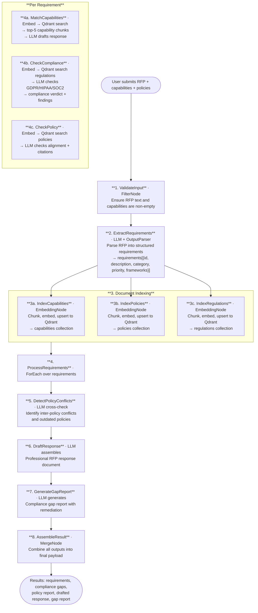

# 030 - RFP Compliance Engine

## Project Overview

This example combines three enterprise document intelligence patterns into a single pipeline: **RFP Response Generator** (#30), **Regulatory Compliance Checker** (#31), and **Policy Document Navigator** (#33). The application ingests an RFP document, company capabilities, internal policies, and regulatory frameworks, then runs a multi-stage analysis that extracts requirements, checks compliance, matches capabilities, detects policy conflicts, and generates a compliant RFP response with a gap report.

Built with ASP.NET Core Blazor Server, the **Twf.Flow** workflow engine, and **Qdrant** for vector storage.

## Objective

Demonstrate a combined document-intelligence pipeline for enterprise RFP processing:

- Use `FilterNode` to validate input documents and configuration
- Use `EmbeddingNode` (via `EmbeddingService`) for semantic indexing of capabilities, policies, and regulations into separate Qdrant collections
- Use `Workflow.ForEach()` (via sequential processing) to iterate over extracted RFP requirements
- Use `LlmNode` (via `LlmService`) with regulation-injected prompts for compliance checking
- Use `OutputParserNode` (via JSON parsing) for structured requirements extraction and compliance classification
- Use `ConditionNode` (via conditional logic) for policy conflict detection
- Use `MergeNode` (via result assembly) for document assembly and gap report generation

## End-to-End Workflow



## Why This Pattern Works

Combining RFP response generation, compliance checking, and policy navigation into a single pipeline eliminates the need for three separate tools and ensures consistency across all analysis dimensions.

- **Holistic analysis** because each requirement is simultaneously evaluated against capabilities, regulations, and policies, preventing contradictory responses
- **Speed** because document indexing happens once upfront, and all subsequent per-requirement analyses use pre-computed embeddings for fast vector retrieval
- **Auditability** because every response includes citations to specific policies, regulations, and capabilities, making the analysis fully traceable
- **Compliance assurance** because regulatory checking is integrated into the response drafting process, not bolted on as an afterthought
- **Conflict detection** because cross-referencing all policies in a single LLM pass identifies contradictions that per-requirement analysis would miss
- **Actionable output** because the gap report provides a prioritized remediation roadmap with effort estimates, not just a list of issues

## Key Features

| Feature | Detail |
|---|---|
| **Requirements extraction** | LLM parses RFP text into structured requirements with IDs, categories, priorities, and compliance frameworks |
| **Semantic document indexing** | Capabilities, policies, and regulations are chunked, embedded, and stored in separate Qdrant collections |
| **Capability matching** | Each requirement is embedded and matched against company capabilities via cosine similarity |
| **Regulatory compliance checking** | LLM checks each requirement against GDPR, HIPAA, SOC 2, FDA, ISO 27001, PCI-DSS with specific clause references |
| **Policy alignment** | Vector retrieval finds relevant policies; LLM checks alignment and cites specific sections |
| **Conflict detection** | Cross-policy analysis identifies inter-policy conflicts and outdated policies |
| **Response drafting** | Professional RFP response document assembled from per-requirement analyses |
| **Gap report** | Compliance gap report with critical gaps, risk levels, and remediation roadmap |
| **Document upload** | PDF and TXT upload with server-side text extraction |
| **Multi-collection Qdrant** | Three separate collections for capabilities, policies, and regulations |

## Inputs

| Input | Purpose | Example |
|---|---|---|
| `rfp_text` | Full RFP document text | `"Request for Proposal: Enterprise Data Platform..."` |
| `capabilities_text` | Company capabilities, certifications, past performance | `"SOC 2 Type II certified since 2022. 50+ cloud..."` |
| `policies_text` | Internal policy documents | `"Data Handling Policy v2.1: All data must be..."` |
| `regulations_text` | Regulatory framework excerpts | `"GDPR Article 28: Where processing is carried out..."` |
| `frameworks` | Compliance frameworks to check against | `["GDPR", "SOC2"]` |

## Expected Output

```json
{
  "requirements": [
    {
      "id": "REQ-001",
      "description": "Vendor must demonstrate SOC 2 Type II compliance",
      "category": "compliance",
      "priority": "critical",
      "compliance_frameworks": ["SOC2"]
    }
  ],
  "compliance_results": [
    {
      "requirement_id": "REQ-001",
      "overall_compliance": "compliant",
      "findings": [],
      "summary": "Vendor demonstrates valid SOC 2 Type II certification."
    }
  ],
  "policy_results": [
    {
      "requirement_id": "REQ-001",
      "alignment": "aligned",
      "citations": [
        {
          "policy_id": "POL-003",
          "policy_title": "Vendor Security Policy",
          "section": "4.1",
          "excerpt": "All vendors handling sensitive data must maintain SOC 2...",
          "alignment": "aligned"
        }
      ],
      "conflicts": [],
      "recommendations": ""
    }
  ],
  "policy_conflicts": {
    "conflicts": [],
    "outdated_policies": [],
    "coverage_gaps": []
  },
  "drafted_response": "## Executive Response\n\n...",
  "gap_report": {
    "executive_summary": "Overall compliance posture is strong...",
    "overall_risk": "low",
    "compliant": 12,
    "partially_compliant": 2,
    "non_compliant": 1,
    "critical_gaps": [],
    "remediation_roadmap": "..."
  },
  "analyzed_at": "2026-06-10T12:00:00Z"
}
```

## Setup

### 1. Start Qdrant

```bash
docker run -p 6334:6334 qdrant/qdrant
```

### 2. Configure the LLM Provider

Create `appsettings.local.json` in the project root:

```json
{
  "OpenAI": {
    "ApiKey": "sk-your-api-key",
    "ChatModel": "gpt-4o",
    "EmbeddingModel": "text-embedding-3-small",
    "Endpoint": "https://api.openai.com/v1/chat/completions",
    "EmbeddingEndpoint": "https://api.openai.com/v1/embeddings"
  },
  "Qdrant": {
    "Host": "localhost",
    "Port": 6334,
    "Https": false,
    "ApiKey": ""
  }
}
```

### 3. Run the Application

```bash
dotnet run
```

The application starts at `https://localhost:7030`.

## Twf.Flow Implementation Sketch

```csharp
var result = await Workflow.Create("RfpComplianceEngine")
    .UseLogger(logger)
    // 1. Validate input
    .AddNode(new FilterNode("ValidateInput")
        .RequireNonEmpty("rfp_text")
        .RequireNonEmpty("capabilities_text"))
    // 2. Extract requirements from RFP
    .AddStep("ExtractRequirements", async (data, _) => {
        var json = await llmService.CompleteAsync(...);
        data.Set("requirements", ParseJson<List<RfpRequirement>>(json));
        return data;
    })
    // 3. Index documents into Qdrant
    .AddStep("IndexCapabilities", async (data, _) => { /* chunk + embed + upsert */ return data; })
    .AddStep("IndexPolicies",     async (data, _) => { /* chunk + embed + upsert */ return data; })
    .AddStep("IndexRegulations",  async (data, _) => { /* chunk + embed + upsert */ return data; })
    // 4. Process each requirement
    .AddStep("ProcessRequirements", async (data, _) => {
        foreach (var req in data.Get<List<RfpRequirement>>("requirements"))
        {
            // 4a. Match capabilities via vector search
            var capVector = await embeddingService.EmbedAsync(req.Description, ...);
            var capChunks = await vectorStore.SearchAsync(capVector, 5, "capabilities");
            var capResponse = await llmService.CompleteAsync(capabilityPrompt, ...);

            // 4b. Check compliance via vector search + LLM
            var regChunks = await vectorStore.SearchAsync(regVector, 8, "regulations");
            var compliance = await llmService.CompleteAsync(compliancePrompt, ...);

            // 4c. Check policy alignment via vector search + LLM
            var polChunks = await vectorStore.SearchAsync(polVector, 5, "policies");
            var policy = await llmService.CompleteAsync(policyPrompt, ...);
        }
        return data;
    })
    // 5. Detect policy conflicts
    .AddStep("DetectPolicyConflicts", async (data, _) => { /* LLM cross-check */ return data; })
    // 6. Draft response
    .AddStep("DraftResponse", async (data, _) => { /* LLM assembly */ return data; })
    // 7. Generate gap report
    .AddStep("GenerateGapReport", async (data, _) => { /* LLM report */ return data; })
    // 8. Assemble final result
    .AddStep("AssembleResult", async (data, _) => { /* merge all outputs */ return data; })
    .RunAsync(input, context, ct);
```
