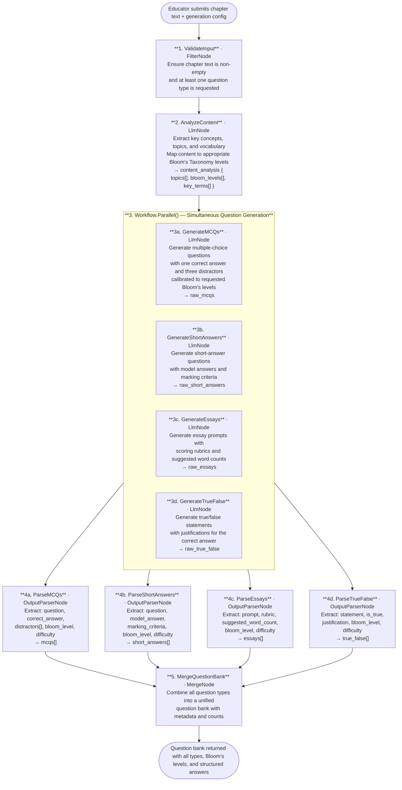

# 032 - Textbook Chapter Question Generator

## Project Overview

This example builds a **textbook chapter question generator** using ASP.NET Core Blazor Server and the **TwfAiFramework**. The application accepts a textbook chapter (or any long-form educational content) and generates a rich question bank — multiple-choice questions (MCQs), short-answer questions, essay prompts, and true/false statements — all calibrated to specific **Bloom's Taxonomy** cognitive levels.

Educators paste or upload a chapter and specify the desired Bloom's Taxonomy levels and question count per type. The application analyses the content, fans out question generation for all four question types in parallel, parses each response into a structured schema (question, correct answer, distractors, Bloom's level, difficulty), and returns a unified question bank ready for export or import into an LMS.

## Objective

Demonstrate a document-intelligence pipeline for education and assessment use cases:

- Use `LlmNode` to analyse chapter content and identify key concepts, topics, and appropriate Bloom's Taxonomy levels
- Use `Workflow.Parallel()` to simultaneously generate MCQs, short-answer questions, essay prompts, and true/false statements from the same source content
- Use `OutputParserNode` to extract structured question objects (question text, correct answer, distractors, Bloom's level, difficulty rating) from each generation pass
- Use `MergeNode` to combine all question types into a single unified question bank

## End-to-End Workflow



## Why This Pattern Works

A naive approach — prompting a single LLM call to produce all question types at once — leads to inconsistent formatting, uneven coverage across types, and responses that exceed context limits for long chapters. Separating content analysis, parallel generation, structured parsing, and merging into discrete stages solves these problems:

- **Speed** because `Workflow.Parallel()` generates all four question types simultaneously rather than sequentially, cutting total latency to the time of the slowest single generation pass
- **Consistency** because each question type has its own dedicated `LlmNode` with a specialised system prompt and its own `OutputParserNode` schema, preventing format bleed between types
- **Bloom's calibration** because the content analysis pass explicitly maps topics to taxonomy levels before generation, giving every downstream node the cognitive context it needs to pitch questions correctly
- **Structured output** because `OutputParserNode` enforces a fixed schema per type (question, answer, distractors, level, difficulty), making the output directly importable into LMS platforms such as Moodle, Canvas, or Google Classroom
- **Scalability** because the parallel fan-out means adding a new question type (e.g., fill-in-the-blank) requires only a new branch in the `Workflow.Parallel()` block and a corresponding parser — no changes to other stages
- **Auditability** because each generated question carries its Bloom's Taxonomy level and difficulty rating, letting educators verify coverage across cognitive domains at a glance

## Key Features

| Feature | Detail |
|---|---|
| **Content analysis** | `LlmNode` pre-analyses the chapter to extract key concepts and map them to Bloom's Taxonomy levels before any questions are generated |
| **Parallel question generation** | `Workflow.Parallel()` fans out MCQ, short-answer, essay, and true/false generation simultaneously, minimising total generation time |
| **Bloom's Taxonomy calibration** | Each generated question is tagged with a Bloom's level (Remember, Understand, Apply, Analyse, Evaluate, Create) and a difficulty rating |
| **Structured extraction** | `OutputParserNode` parses LLM output into typed question objects with correct answers, distractors, rubrics, and justifications |
| **Configurable question counts** | Per-type counts and target Bloom's levels are runtime inputs, not hard-coded values |
| **Unified question bank** | `MergeNode` combines all types into a single exportable payload, including summary counts per type and per Bloom's level |

## Inputs

| Input | Purpose | Example |
|---|---|---|
| `chapter_text` | Full text of the textbook chapter or educational content | `"Chapter 4: Cellular Respiration. Cellular respiration is the process by which..."` |
| `mcq_count` | Number of multiple-choice questions to generate | `10` |
| `short_answer_count` | Number of short-answer questions to generate | `5` |
| `essay_count` | Number of essay prompts to generate | `2` |
| `true_false_count` | Number of true/false statements to generate | `8` |
| `bloom_levels` | Bloom's Taxonomy levels to target (one or more) | `["Remember", "Understand", "Apply", "Analyse"]` |
| `difficulty` | Target difficulty range | `"mixed"` or `"easy"` / `"medium"` / `"hard"` |

## Expected Output

```json
{
  "question_bank": {
    "mcqs": [
      {
        "question": "Which molecule is the primary energy currency of the cell?",
        "correct_answer": "ATP",
        "distractors": ["ADP", "NADH", "Glucose"],
        "bloom_level": "Remember",
        "difficulty": "easy"
      },
      {
        "question": "During glycolysis, glucose is broken down into two molecules of which compound?",
        "correct_answer": "Pyruvate",
        "distractors": ["Acetyl-CoA", "Lactate", "Oxaloacetate"],
        "bloom_level": "Understand",
        "difficulty": "medium"
      }
    ],
    "short_answers": [
      {
        "question": "Explain the role of the electron transport chain in ATP synthesis.",
        "model_answer": "The electron transport chain transfers electrons from NADH and FADH2 through a series of protein complexes in the inner mitochondrial membrane, creating a proton gradient that drives ATP synthase to produce ATP via oxidative phosphorylation.",
        "marking_criteria": "Award 1 mark each for: electron donors (NADH/FADH2), location (inner mitochondrial membrane), proton gradient, ATP synthase, oxidative phosphorylation.",
        "bloom_level": "Understand",
        "difficulty": "medium"
      }
    ],
    "essays": [
      {
        "prompt": "Compare and contrast aerobic and anaerobic respiration, evaluating the conditions under which each pathway is favoured and the implications for athletic performance.",
        "rubric": "Excellent (18–20): Accurate description of both pathways with correct ATP yields; insightful analysis of conditions; well-supported evaluation with real-world application. Good (14–17): Correct descriptions; adequate comparison; limited evaluation. Satisfactory (10–13): Basic descriptions; superficial comparison; no evaluation.",
        "suggested_word_count": 600,
        "bloom_level": "Evaluate",
        "difficulty": "hard"
      }
    ],
    "true_false": [
      {
        "statement": "Glycolysis occurs in the mitochondrial matrix.",
        "is_true": false,
        "justification": "Glycolysis takes place in the cytoplasm (cytosol), not in the mitochondrial matrix. It is the only stage of cellular respiration that does not require mitochondria.",
        "bloom_level": "Remember",
        "difficulty": "easy"
      }
    ]
  },
  "summary": {
    "total_questions": 25,
    "counts_by_type": {
      "mcq": 10,
      "short_answer": 5,
      "essay": 2,
      "true_false": 8
    },
    "counts_by_bloom_level": {
      "Remember": 8,
      "Understand": 9,
      "Apply": 4,
      "Analyse": 2,
      "Evaluate": 2,
      "Create": 0
    }
  },
  "generated_at": "2026-05-16T10:00:00Z"
}
```

## Suggested Project Structure

```text
032_TextbookChapterQuestionGenerator/
├── Components/
│   ├── Pages/
│   │   ├── Generate.razor                   # Chapter input form and generation config
│   │   └── QuestionBank.razor               # Tabbed view of generated questions with export
│   ├── Layout/
│   │   ├── MainLayout.razor
│   │   └── NavMenu.razor
│   └── App.razor
├── Controllers/
│   └── QuestionController.cs                # POST /api/questions/generate
├── Models/
│   ├── GenerationRequest.cs                 # chapter_text, counts, bloom_levels, difficulty
│   ├── McqQuestion.cs                       # question, correct_answer, distractors[], bloom_level, difficulty
│   ├── ShortAnswerQuestion.cs               # question, model_answer, marking_criteria, bloom_level, difficulty
│   ├── EssayQuestion.cs                     # prompt, rubric, suggested_word_count, bloom_level, difficulty
│   ├── TrueFalseQuestion.cs                 # statement, is_true, justification, bloom_level, difficulty
│   ├── ContentAnalysis.cs                   # topics[], bloom_levels[], key_terms[]
│   └── QuestionBankResult.cs                # question_bank, summary, generated_at
├── Services/
│   └── QuestionGenerationWorkflowService.cs # Builds and runs the end-to-end generation workflow
├── Constants.cs                             # System prompt templates for each question type
├── Program.cs                               # Dependency injection and app bootstrap
├── appsettings.json                         # Model and generation defaults
└── appsettings.local.json                   # Local API key overrides (gitignored)
```

## Setup

### 1. Configure the LLM Provider

Create `appsettings.local.json` in the project root:

```json
{
  "OpenAI": {
    "ApiKey": "sk-your-api-key",
    "ChatModel": "gpt-4o",
    "Endpoint": "https://api.openai.com/v1"
  }
}
```

### 2. Run the Application

```bash
dotnet run
```

The application starts at `https://localhost:5001`.

### 3. Typical Generation Flow

1. Educator opens the Generate page, pastes the chapter text, and selects question counts and target Bloom's levels.
2. `LlmNode` analyses the chapter to extract key concepts and map them to Bloom's Taxonomy levels.
3. `Workflow.Parallel()` fans out four generation nodes simultaneously, each producing raw question text for its type.
4. Four `OutputParserNode` instances parse each raw response into typed question objects with correct answers, distractors or rubrics, Bloom's level, and difficulty.
5. `MergeNode` combines all question types into a unified question bank with summary counts.
6. The question bank is displayed on the QuestionBank page, organised by type in tabs, with an export button for JSON or CSV.

## TwfAiFramework Implementation Sketch

```csharp
var result = await Workflow.Create("TextbookQuestionGenerator")
    .UseLogger(logger)
    // 1. Validate input
    .AddNode(new FilterNode(data =>
        !string.IsNullOrWhiteSpace(data.Get<string>("chapter_text")) &&
        data.Get<int>("mcq_count") + data.Get<int>("short_answer_count") +
        data.Get<int>("essay_count") + data.Get<int>("true_false_count") > 0))
    // 2. Analyse chapter content and map to Bloom's Taxonomy
    .AddNode(new LlmNode(new LlmConfig
    {
        Provider     = "openai",
        Model        = config["OpenAI:ChatModel"]!,
        ApiKey       = config["OpenAI:ApiKey"]!,
        SystemPrompt = Constants.ContentAnalysisPrompt
    }, name: "AnalyzeContent", outputField: "content_analysis"))
    // 3. Generate all question types in parallel
    .AddNode(Workflow.Parallel(
        // 3a. MCQs
        branch => branch
            .AddNode(new LlmNode(new LlmConfig
            {
                Provider     = "openai",
                Model        = config["OpenAI:ChatModel"]!,
                ApiKey       = config["OpenAI:ApiKey"]!,
                SystemPrompt = Constants.McqGenerationPrompt
            }, name: "GenerateMCQs", outputField: "raw_mcqs"))
            .AddNode(new OutputParserNode(
                outputField: "mcqs",
                schema: typeof(List<McqQuestion>))),
        // 3b. Short-answer questions
        branch => branch
            .AddNode(new LlmNode(new LlmConfig
            {
                Provider     = "openai",
                Model        = config["OpenAI:ChatModel"]!,
                ApiKey       = config["OpenAI:ApiKey"]!,
                SystemPrompt = Constants.ShortAnswerGenerationPrompt
            }, name: "GenerateShortAnswers", outputField: "raw_short_answers"))
            .AddNode(new OutputParserNode(
                outputField: "short_answers",
                schema: typeof(List<ShortAnswerQuestion>))),
        // 3c. Essay prompts
        branch => branch
            .AddNode(new LlmNode(new LlmConfig
            {
                Provider     = "openai",
                Model        = config["OpenAI:ChatModel"]!,
                ApiKey       = config["OpenAI:ApiKey"]!,
                SystemPrompt = Constants.EssayGenerationPrompt
            }, name: "GenerateEssays", outputField: "raw_essays"))
            .AddNode(new OutputParserNode(
                outputField: "essays",
                schema: typeof(List<EssayQuestion>))),
        // 3d. True/false statements
        branch => branch
            .AddNode(new LlmNode(new LlmConfig
            {
                Provider     = "openai",
                Model        = config["OpenAI:ChatModel"]!,
                ApiKey       = config["OpenAI:ApiKey"]!,
                SystemPrompt = Constants.TrueFalseGenerationPrompt
            }, name: "GenerateTrueFalse", outputField: "raw_true_false"))
            .AddNode(new OutputParserNode(
                outputField: "true_false",
                schema: typeof(List<TrueFalseQuestion>)))
    ))
    // 4. Merge all question types into a unified question bank
    .AddNode(new MergeNode(fields: new[]
    {
        "mcqs", "short_answers", "essays", "true_false", "content_analysis"
    }))
    .RunAsync(new WorkflowData()
        .Set("chapter_text",       request.ChapterText)
        .Set("mcq_count",          request.McqCount)
        .Set("short_answer_count", request.ShortAnswerCount)
        .Set("essay_count",        request.EssayCount)
        .Set("true_false_count",   request.TrueFalseCount)
        .Set("bloom_levels",       request.BloomLevels)
        .Set("difficulty",         request.Difficulty));
```
