# 036 - AI Pair Programmer with Codebase Context

## Project Overview

This example builds an **AI pair programmer** using ASP.NET Core Blazor Server and the **TwfAiFramework**. The application indexes a full codebase, captures architecture and coding conventions, stores embeddings in Qdrant, retrieves the most relevant files for a user request, and generates implementation guidance or new code that is consistent with existing patterns.

Developers submit a natural-language request such as "add pagination to the user list" or "explain the authentication flow". The workflow chunks source files, creates embeddings for semantic search, retrieves top matching snippets through vector lookup, injects those snippets into a structured prompt, and uses an LLM to produce answers, implementation plans, and code patches grounded in repository context.

Detailed implementation notes are available in `docs/INDEXING_AND_RETRIEVAL_FLOW.md`.

## Objective

Demonstrate a code-intelligence workflow for developer productivity:

- Use `EmbeddingNode` to convert repository files into vector embeddings for semantic code search
- Use Qdrant REST API to store and retrieve vectors from a vector database endpoint
- Use `PromptBuilderNode` to inject retrieved code context, conventions, and user intent into a deterministic prompt template
- Use `LlmNode` to generate architecture-aware answers, feature scaffolds, and refactoring suggestions

## End-to-End Workflow

```mermaid
flowchart TD
    START([Developer asks a coding question or feature request]) --> ValidateInput

    ValidateInput["**1. ValidateInput** · FilterNode\nEnsure request is non-empty and repo path is configured"]

    ValidateInput --> BuildFileList

    BuildFileList["**2. BuildFileList** · HttpRequestNode or local scanner API\nCollect project files and metadata\n→ file_manifest[]"]

    BuildFileList --> ChunkAndEmbed

    ChunkAndEmbed["**3. ChunkAndEmbed** · Workflow.ForEach() + EmbeddingNode\nSplit files into chunks and generate vectors\n→ code_chunks[] with embeddings"]

    ChunkAndEmbed --> UpsertVectors

    UpsertVectors["**4. UpsertVectors** · HttpRequestNode\nUpsert embeddings and metadata to vector store"]

    UpsertVectors --> RetrieveContext

    RetrieveContext["**5. RetrieveContext** · EmbeddingNode + HttpRequestNode\nEmbed user request and run top-k vector search\n→ retrieved_context[]"]

    RetrieveContext --> BuildPrompt

    BuildPrompt["**6. BuildPrompt** · PromptBuilderNode\nInject user request + retrieved snippets + coding conventions\n→ grounded_prompt"]

    BuildPrompt --> GenerateAnswer

    GenerateAnswer["**7. GenerateAnswer** · LlmNode\nGenerate explanation, implementation steps, and code output\n→ raw_response"]

    GenerateAnswer --> ParseOutput

    ParseOutput["**8. ParseOutput** · OutputParserNode\nExtract: summary, risks, files_to_change, code_blocks[]"]

    ParseOutput --> END([Context-aware pair-programming response returned to UI])
```



## Why This Pattern Works

A single LLM prompt without retrieval often invents structure, misses local conventions, and outputs code that does not match existing abstractions. Splitting indexing, retrieval, prompt construction, and generation into discrete steps improves reliability:

- **Grounded generation** because answers are based on actual repository snippets retrieved by semantic similarity
- **Consistency with local style** because prompt context can include naming patterns, folder layout, and architectural conventions
- **Lower hallucination rate** because `PromptBuilderNode` constrains the model to evidence from retrieved files
- **Reusable index** because embeddings are generated once and reused across many user questions
- **Scalability** because chunk-level retrieval keeps context focused even for large repositories
- **Actionability** because parsed output can separate explanation, impacted files, and concrete code blocks

## Key Features

| Feature | Detail |
|---|---|
| **Repository indexing** | `EmbeddingNode` generates vectors for code chunks across the codebase |
| **Semantic retrieval** | Qdrant vector search returns top-k nearest code chunks for each request |
| **Context-aware prompting** | `PromptBuilderNode` combines retrieved code with architecture constraints and coding standards |
| **Code generation** | `LlmNode` produces grounded explanations, implementation steps, and code proposals |
| **Structured output** | `OutputParserNode` extracts summary, risk notes, target files, and patch-ready code blocks |
| **Incremental re-indexing** | Changed files can be re-embedded and upserted without rebuilding the whole index |

## Inputs

| Input | Purpose | Example |
|---|---|---|
| `repo_path` | Path to project root that should be indexed | `"/src/my-service"` |
| `user_request` | Natural-language coding request | `"Add request caching for product search endpoint"` |
| `top_k` | Number of code chunks retrieved for context | `8` |
| `languages` | Optional language filters for indexing | `["csharp", "typescript"]` |
| `max_chunk_tokens` | Chunk size for embedding generation | `600` |
| `task_type` | Output mode for the assistant | `"explain"`, `"implement"`, `"refactor"` |

## Expected Output

```json
{
  "summary": "Add an in-memory caching layer for ProductSearchController with 60-second TTL.",
  "implementation_plan": [
    "Create an IProductSearchCache abstraction in Services/Cache.",
    "Inject cache dependency into ProductSearchController.",
    "Cache search responses by normalized query + filter hash.",
    "Add invalidation hook in product update workflow.",
    "Add unit tests for cache hit, miss, and expiry behavior."
  ],
  "files_to_change": [
    "Controllers/ProductSearchController.cs",
    "Services/Cache/ProductSearchCache.cs",
    "Services/DependencyInjection.cs",
    "Tests/ProductSearchControllerTests.cs"
  ],
  "code_blocks": [
    {
      "file": "Services/Cache/ProductSearchCache.cs",
      "language": "csharp",
      "content": "public sealed class ProductSearchCache : IProductSearchCache { /* ... */ }"
    }
  ],
  "risks": [
    "Cached responses may be stale after product updates.",
    "Cache key cardinality should be monitored for memory growth."
  ],
  "used_context": [
    "Controllers/ProductSearchController.cs",
    "Services/Search/ProductQueryService.cs",
    "Program.cs"
  ],
  "generated_at": "2026-05-23T09:00:00Z"
}
```

## Suggested Project Structure

```text
036_AI_Pair_Programmer/
├── Components/
│   ├── Pages/
│   │   ├── Chat.razor                         # Request input and generated response UI
│   │   └── ContextViewer.razor                # Retrieved snippets and source traceability
│   ├── Layout/
│   │   ├── MainLayout.razor
│   │   └── NavMenu.razor
│   └── App.razor
├── Controllers/
│   └── PairProgrammerController.cs            # POST /api/pair-programmer/query
├── Models/
│   ├── IndexRequest.cs                        # repo_path, languages, max_chunk_tokens
│   ├── QueryRequest.cs                        # user_request, top_k, task_type
│   ├── RetrievedChunk.cs                      # file, snippet, score, start_line, end_line
│   └── PairProgrammerResult.cs                # summary, plan, files_to_change, code_blocks
├── Services/
│   ├── CodeIndexingWorkflowService.cs         # File chunking + EmbeddingNode + vector upsert
│   └── PairProgrammingWorkflowService.cs       # Retrieval + PromptBuilderNode + LlmNode
├── Constants.cs                               # Prompt templates and coding guardrails
├── Program.cs                                 # Dependency injection and app bootstrap
├── appsettings.json                           # Model, embedding, and vector endpoint settings
└── appsettings.local.json                     # Local API key overrides (gitignored)
```

## Setup

### 1. Configure Provider and Qdrant Endpoint

Create `appsettings.local.json` in the project root:

```json
{
  "OpenAI": {
    "ApiKey": "sk-your-api-key",
    "ChatModel": "gpt-4o-mini",
    "EmbeddingModel": "text-embedding-3-small",
    "Endpoint": "https://api.openai.com/v1"
  },
  "Qdrant": {
    "BaseUrl": "https://your-qdrant-host:6333",
    "ApiKey": "",
    "CollectionName": "repo-code-index"
  }
}
```

If `Qdrant:BaseUrl` is empty, the app falls back to in-memory retrieval for local testing.

### 2. Run the Application

```bash
dotnet run
```

The application starts at `https://localhost:5001`.

### 3. Typical Usage Flow

1. Developer chooses a repository path and runs indexing.
2. The indexing workflow chunks files, embeds chunks, and upserts vectors to Qdrant.
3. Developer submits a question or feature request in the chat UI.
4. The query workflow embeds the request and retrieves top-k matching code chunks from Qdrant.
5. `PromptBuilderNode` composes a context-grounded prompt with the retrieved snippets.
6. `LlmNode` generates a response with explanation, implementation plan, and code.
7. Parsed output is rendered in the UI with source traceability for each suggestion.

## TwfAiFramework Implementation Sketch

```csharp
var result = await WorkflowBuilder.Create("AiPairProgrammer")
    .UseLogger(logger)
    // 1. Validate input
    .AddNode(new FilterNode(data =>
        !string.IsNullOrWhiteSpace(data.Get<string>("repo_path")) &&
        !string.IsNullOrWhiteSpace(data.Get<string>("user_request"))))
    // 2. Embed user request for retrieval
    .AddNode(new EmbeddingNode(new EmbeddingConfig
    {
        Provider = "openai",
        Model    = config["OpenAI:EmbeddingModel"]!,
        ApiKey   = config["OpenAI:ApiKey"]!
    }, inputField: "user_request", outputField: "query_embedding"))
    // 3. Retrieve top-k code chunks from vector store
    .AddNode(new HttpRequestNode("RetrieveContext", new HttpRequestConfig
    {
        Method      = "POST",
        UrlTemplate = "{{vector_base_url}}/query",
        Headers     = new()
        {
            ["Authorization"] = "Bearer {{vector_api_key}}",
            ["Content-Type"]  = "application/json"
        },
        BodyTemplate = "{ \"index\": \"{{index_name}}\", \"top_k\": {{top_k}}, \"vector\": {{query_embedding}} }"
    }))
    // 4. Build grounded code-generation prompt
    .AddNode(new PromptBuilderNode(
        promptTemplate:
            "You are assisting with this request:\n{{user_request}}\n\n" +
            "Use only this retrieved code context:\n{{http_response}}\n\n" +
            "Return: summary, implementation_plan, files_to_change, code_blocks, risks.",
        systemTemplate:
            "You are a senior software engineer. Match existing architecture and naming conventions. " +
            "If context is insufficient, clearly state assumptions."))
    // 5. Generate response
    .AddNode(new LlmNode(new LlmConfig
    {
        Provider = "openai",
        Model    = config["OpenAI:ChatModel"]!,
        ApiKey   = config["OpenAI:ApiKey"]!
    }))
    // 6. Parse response into structured fields
    .AddNode(new OutputParserNode(fieldMapping: new()
    {
        ["summary"]             = "summary",
        ["implementation_plan"] = "implementation_plan",
        ["files_to_change"]     = "files_to_change",
        ["code_blocks"]         = "code_blocks",
        ["risks"]               = "risks"
    }))
    .RunAsync(new WorkflowData()
        .Set("repo_path", "/src/my-repo")
        .Set("user_request", "Add pagination to the users endpoint")
        .Set("top_k", 8)
        .Set("vector_base_url", config["VectorStore:BaseUrl"]!)
        .Set("vector_api_key", config["VectorStore:ApiKey"]!)
        .Set("index_name", config["VectorStore:IndexName"]!));
```

## Extensions and Production Hardening

- Add language-aware chunking to preserve class and function boundaries
- Add `ConditionNode` fallbacks when retrieval confidence is below threshold
- Add repository-level convention extraction (naming, test patterns, logging style)
- Add diff generation mode that emits patch hunks instead of full files
- Add evaluation prompts that score generated code for correctness and convention match
