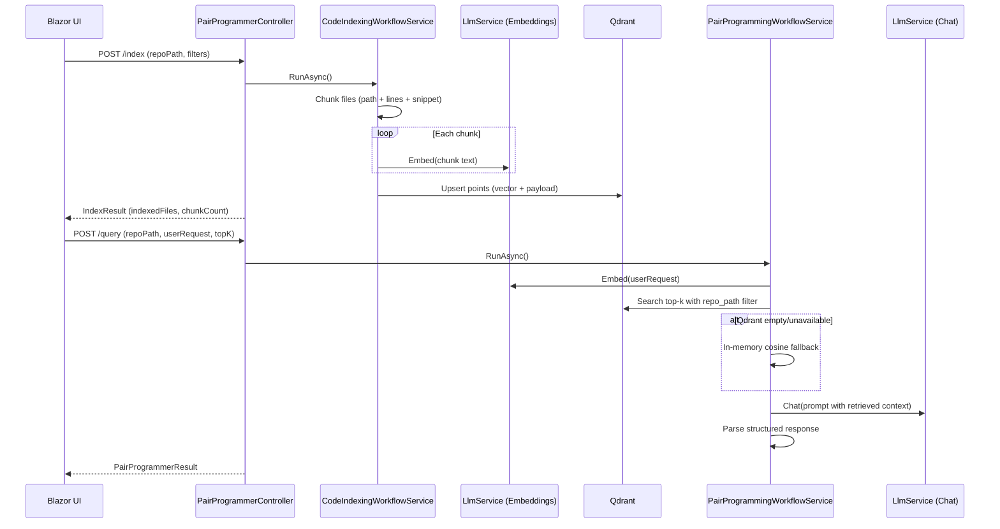

# 036 AI Pair Programmer: Indexing and Retrieval Flow

This document explains how example 036 indexes code, stores vectors, and retrieves the right context for query answering.

## 1. High-level architecture

The flow has two runtime phases:

1. Index phase
- Read repository files
- Chunk code into manageable segments
- Generate embeddings
- Store vectors in Qdrant (and in-memory cache as local fallback)

2. Query phase
- Embed user query
- Retrieve top-k semantically similar chunks from Qdrant
- Fallback to in-memory cosine search if needed
- Build a grounded prompt from retrieved chunks
- Generate and parse final answer

## 2. API endpoints

Controller: PairProgrammerController

- POST /api/PairProgrammer/index
  - Input: repo path, language filters, chunking limits
  - Output: indexed file count and chunk count

- POST /api/PairProgrammer/query
  - Input: repo path, user request, top-k, task type
  - Output: structured response with summary, plan, file suggestions, code blocks, risks

## 3. Indexing: how files are read and chunked

Service: CodeChunkerService

### File discovery
The indexer walks all files under the selected repo path and:
- skips directories: bin, obj, .git, node_modules, .idea, .vscode
- keeps files by extension filter

Default extensions include:
- .cs, .razor, .json, .md, .yml, .yaml, .xml
- .ts, .tsx, .js, .jsx, .py, .go, .java, .sql, .sh

If languages are provided, they are mapped to extensions, for example:
- csharp -> .cs, .razor
- typescript -> .ts, .tsx
- javascript -> .js, .jsx
- python -> .py

### Chunking strategy
For each selected file:
- read all lines
- accumulate lines into a buffer
- emit a chunk when buffer reaches target size

Target size is approximate chars based on token budget:
- targetChars = clamp(maxChunkTokens, 200, 2000) * 4

Each chunk stores:
- relative file path
- snippet text
- start line
- end line

This gives traceable context later in query responses.

## 4. Embedding generation

Service: LlmService.EmbedAsync

For each chunk, the app calls the embeddings API with:
- model from OpenAI:EmbeddingModel
- endpoint derived from OpenAI:Endpoint
- chunk text as input

Output:
- float[] embedding vector for each chunk

These vectors are wrapped with metadata as IndexedChunk objects.

## 5. Vector storage in Qdrant

Service: QdrantVectorStoreService

### Config keys
- Qdrant:BaseUrl
- Qdrant:ApiKey
- Qdrant:CollectionName

If BaseUrl is missing, Qdrant is treated as disabled.

### Collection setup
Before upsert, the service ensures the collection exists:
- PUT /collections/{collection}
- vector size = embedding length
- distance = Cosine

### Point identity and payload
Each chunk becomes one Qdrant point:
- point id: deterministic SHA-256 hash of repoPath + filePath + startLine + endLine
- vector: embedding array
- payload:
  - repo_path
  - file_path
  - snippet
  - start_line
  - end_line

Upserts run in batches (64 points per request):
- PUT /collections/{collection}/points?wait=true

### Why deterministic IDs
If you re-index the same repository chunk, the same point id is generated, so Qdrant updates existing points instead of duplicating them.

## 6. Query retrieval: how matching works

Service: PairProgrammingWorkflowService

### Step A: embed the user query
- Query text is embedded using same embedding model family
- This creates a vector in the same semantic space as indexed chunks

### Step B: Qdrant top-k search
- POST /collections/{collection}/points/search
- Search vector = query embedding
- limit = topK (1..20)
- filter by payload repo_path to avoid cross-repo contamination
- with_payload = true

Qdrant returns points with score and payload. The app converts these into RetrievedChunk items:
- file path
- snippet
- start/end line
- score

### Step C: fallback behavior
If Qdrant is not configured or returns no results:
- retrieve from in-memory cache
- rank by cosine similarity in-process

If both Qdrant and in-memory are empty:
- throw IndexNotFound and return a clear API error

## 7. Grounded response generation

After retrieval, the app composes a grounded prompt:
- user request
- task type
- ordered retrieved chunks with scores and file:line ranges

Then it calls chat completion and parses structured JSON output into:
- summary (plain + markdown/html forms)
- implementation plan
- files to change
- code blocks
- risks
- used context files

This is why the answer stays aligned with actual codebase context instead of generic suggestions.

## 8. End-to-end sequence

## 9. Practical tuning notes

- Keep maxChunkTokens moderate (400-800) for balanced recall and precision.
- Use language filters to reduce noise for large monorepos.
- Increase topK when requests involve cross-cutting architecture changes.
- Re-index after significant refactors so vectors reflect current code.
- Use a stable Qdrant CollectionName per environment.

## 10. Failure modes and behavior

- Missing OpenAI key: API returns validation error.
- Missing repo path or invalid path: API returns bad request/not found.
- No index found for query: returns IndexNotFound.
- Model emits non-JSON response: parser falls back to plain summary and still returns useful output.

## 11. File map (where each part lives)

- Controller
  - Controllers/PairProgrammerController.cs

- Indexing
  - Services/CodeChunkerService.cs
  - Services/CodeIndexingWorkflowService.cs

- Vector DB integration
  - Services/QdrantVectorStoreService.cs

- Query + response generation
  - Services/PairProgrammingWorkflowService.cs
  - Services/LlmService.cs

- Contracts
  - Models/IndexRequest.cs
  - Models/QueryRequest.cs
  - Models/PairProgrammerResult.cs
