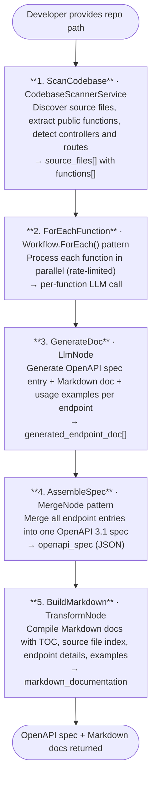

# 038 — API Documentation Generator

## Project Overview

This example builds an **API Documentation Generator** using ASP.NET Core and the **TwfAiFramework**. The application scans a codebase, extracts public API endpoints and functions, generates OpenAPI 3.1 specifications, produces usage examples, and compiles Markdown documentation — all automatically.

Developers point the tool at a repository path, and it identifies controllers, routes, and public methods across multiple languages (C#, TypeScript, JavaScript, Python, Java, Go, etc.). Each function is processed through an LLM to generate OpenAPI spec entries, usage examples, and human-readable documentation, which are then assembled into a complete API reference.

## Objective

Demonstrate an automated API documentation workflow for developer productivity:

- Use `HttpRequestNode` pattern (file scanning) to discover source files and extract public API signatures
- Use `Workflow.ForEach()` pattern to process each function through the LLM for doc generation
- Use `LlmNode` to generate OpenAPI spec entries, usage examples, and Markdown docs per endpoint
- Use `MergeNode` pattern to assemble individual endpoint specs into a complete OpenAPI 3.1 document

## End-to-End Workflow



## Why This Pattern Works

Manual API documentation is error-prone, quickly becomes stale, and consumes significant developer time:

- **Always up to date** because docs are regenerated from the actual codebase on demand
- **Consistent format** because every endpoint follows the same OpenAPI spec structure
- **Multi-language support** scans C#, TypeScript, JavaScript, Python, Java, Go, Ruby, Rust, PHP, Kotlin, and Swift codebases
- **Rich documentation** includes parameter schemas, response types, usage examples in multiple languages, and Markdown with a table of contents
- **Scalable** because the `Workflow.ForEach()` pattern processes functions in parallel with rate limiting

## Key Features

| Feature | Detail |
|---|---|
| **Codebase scanning** | Discovers source files and extracts public functions, controllers, routes, and XML doc comments |
| **Multi-language support** | Parses C#, TypeScript, JavaScript, Python, Java, Go, Ruby, Rust, PHP, Kotlin, Swift |
| **OpenAPI spec generation** | Produces a complete OpenAPI 3.1 document from individual endpoint entries |
| **Usage examples** | LLM generates realistic code examples in curl, Python, and C# per endpoint |
| **Markdown documentation** | Compiles a readable API reference with table of contents, source file index, and endpoint details |
| **Parallel processing** | Functions are processed concurrently with configurable rate limiting |

## Inputs

| Input | Purpose | Default |
|---|---|---|
| `repo_path` | Path to the source code repository to document | *required* |
| `languages` | Language filters (empty = all supported) | `[]` |
| `max_files` | Maximum files to scan | `500` |
| `api_title` | Title for the generated API docs | `"API Documentation"` |
| `api_version` | Version string for the API spec | `"1.0.0"` |
| `base_url` | Base URL for the API | `"https://api.example.com"` |
| `generate_markdown` | Whether to generate Markdown docs | `true` |
| `generate_openapi_spec` | Whether to generate OpenAPI spec | `true` |

## Expected Output

```json
{
  "api_title": "My API",
  "api_version": "1.0.0",
  "base_url": "https://api.example.com",
  "endpoints_documented": 12,
  "files_scanned": 8,
  "generated_at": "2026-06-08T11:30:00Z",
  "open_api_spec": { /* Full OpenAPI 3.1 JSON */ },
  "markdown_documentation": "# My API\n\n**API Version:** 1.0.0\n...",
  "endpoints": [
    {
      "path": "/api/products",
      "http_method": "GET",
      "operation_id": "getProducts",
      "summary": "Retrieve all products",
      "tags": ["products"],
      "usage_examples": {
        "curl": "curl -X GET https://api.example.com/api/products",
        "python": "import requests\nresponse = requests.get('https://api.example.com/api/products')"
      }
    }
  ],
  "duration": "00:00:15.4320000"
}
```

## Project Structure

```text
038_API_Documentation_Generator/
├── Controllers/
│   └── ApiDocsController.cs            # POST /api/apidocs/generate, POST /api/apidocs/scan
├── Models/
│   ├── ApiDocumentationResult.cs        # Final output: spec, docs, endpoints
│   ├── ApiFunction.cs                   # Extracted function signature + metadata
│   ├── GeneratedEndpointDoc.cs          # LLM-generated doc per endpoint
│   ├── ScanRequest.cs                   # Input parameters
│   └── SourceFile.cs                    # Scanned source file with functions
├── Services/
│   ├── ApiDocWorkflowService.cs         # Workflow orchestration (scan → foreach → LLM → merge)
│   ├── CodebaseScannerService.cs        # File discovery + function extraction
│   └── LlmService.cs                    # OpenAI chat completion wrapper
├── Constants.cs                         # Prompts, messages, regex patterns
├── Program.cs                           # DI setup and app bootstrap
├── appsettings.json                     # OpenAI and scanning configuration
└── 038_API_Documentation_Generator.csproj
```

## Setup

### 1. Configure API Key

Create `appsettings.local.json` in the project root:

```json
{
  "OpenAI": {
    "ApiKey": "sk-your-api-key",
    "ChatModel": "gpt-4o-mini",
    "Endpoint": "https://api.openai.com/v1"
  }
}
```

### 2. Run the Application

```bash
dotnet run
```

The application starts at `https://localhost:5001`.

### 3. Generate Documentation

```bash
# Scan a codebase first (preview endpoints found)
curl -X POST https://localhost:5001/api/apidocs/scan \
  -H "Content-Type: application/json" \
  -d '{
    "repoPath": "/path/to/your/project",
    "languages": ["csharp", "typescript"]
  }'

# Generate full API documentation
curl -X POST https://localhost:5001/api/apidocs/generate \
  -H "Content-Type: application/json" \
  -d '{
    "repoPath": "/path/to/your/project",
    "apiTitle": "My Service API",
    "apiVersion": "2.0.0",
    "baseUrl": "https://api.myservice.com/v2",
    "languages": ["csharp", "typescript"]
  }'
```

## TwfAiFramework Implementation Sketch

```csharp
var result = await WorkflowBuilder.Create("ApiDocGenerator")
    .UseLogger(logger)
    // 1. Scan codebase — HttpRequestNode pattern via local scanner
    .AddNode(new CodebaseScannerNode(scannerService,
        inputField: "repo_path", outputField: "source_files"))
    // 2. ForEach over all functions — Workflow.ForEach pattern
    .AddNode(new ForEachNode("functions",
        // 3. Generate per-endpoint doc via LLM — LlmNode
        .AddNode(new PromptBuilderNode(
            promptTemplate: Constants.Prompts.DocGenerationUserPrompt,
            systemTemplate: Constants.Prompts.DocGenerationSystemPrompt))
        .AddNode(new LlmNode(new LlmConfig { Model = "gpt-4o-mini" }))
        .AddNode(new OutputParserNode(
            fieldMapping: new() { ["path"] = "endpoint_path", /* ... */ }))
    ))
    // 4. Merge all endpoint specs into one OpenAPI document — MergeNode
    .AddNode(new MergeNode("endpoints",
        outputField: "merged_openapi_spec"))
    // 5. Generate final output
    .AddNode(new TransformNode(data => {
        // Compile Markdown from merged endpoints
    }))
    .RunAsync(new WorkflowData()
        .Set("repo_path", "/src/my-api")
        .Set("api_title", "My API")
        .Set("api_version", "1.0.0"));
```

## Extensions and Production Hardening

- Add `ConditionNode` to skip non-public or trivial functions (getters/setters, private helpers)
- Add caching so previously generated endpoint docs are reused when source hasn't changed
- Add a watch mode that regenerates docs when source files change
- Add support for scanning NuGet/package-level API surface area
- Add diff output so only changed endpoints are regenerated
- Add custom output formats: HTML (via Markdig), PDF, DocFX, or Slate-compatible YAML
- Add authentication detection (OAuth, API key, JWT) and include security schemes in the OpenAPI spec
